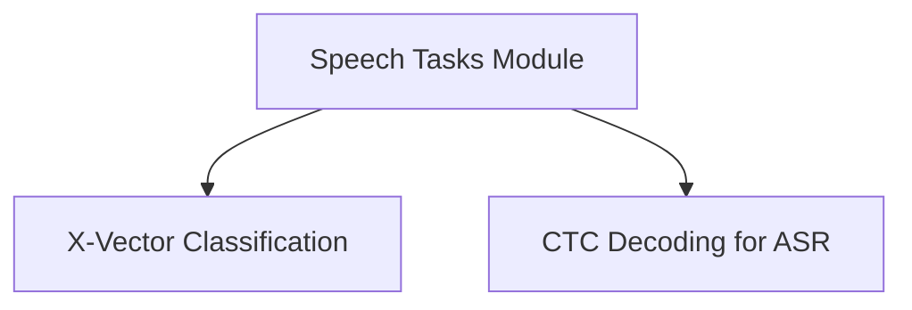

# Speech Tasks Module

The `speech_tasks` module within the `unispeech_sat_models` provides specialized functionalities for various speech processing tasks, leveraging the UniSpeechSat architecture. It includes components for both speaker verification/recognition (X-vector classification) and Automatic Speech Recognition (ASR) via Connectionist Temporal Classification (CTC).

## Architecture Overview

The module is structured into distinct sub-modules, each dedicated to a specific speech task. These sub-modules build upon the core UniSpeechSat model to deliver specialized capabilities.

<!-- DIAGRAM_JSON
{
    "direction": "TD",
    "nodes": [
        {"id": "xvector_classification", "label": "X-Vector Classification", "type": "module", "link": "xvector_classification.md"},
        {"id": "ctc_decoding", "label": "CTC Decoding for ASR", "type": "module", "link": "ctc_decoding.md"}
    ],
    "edges": [
        {"source": "unispeech_sat_models", "target": "xvector_classification"},
        {"source": "unispeech_sat_models", "target": "ctc_decoding"}
    ],
    "groups": []
}
-->

## Sub-modules

### [X-Vector Classification](xvector_classification.md)
This sub-module focuses on speaker recognition and verification tasks. It utilizes the UniSpeechSat model to extract x-vector embeddings, which are then used for classification.

### [CTC Decoding for ASR](ctc_decoding.md)
This sub-module provides the necessary components for Automatic Speech Recognition (ASR) using Connectionist Temporal Classification (CTC). It enables the model to transcribe speech into text.
