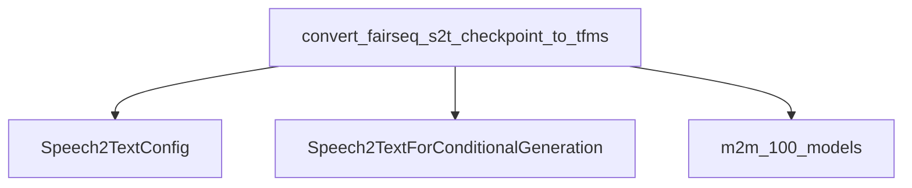

# Speech-to-Text Models Documentation

## Introduction
This module provides utilities for handling Speech-to-Text models, primarily focusing on conversion of checkpoints from other frameworks to the `transformers` library's format. Its core functionality enables seamless integration of models trained elsewhere into the `transformers` ecosystem.

## Architecture and Component Relationships

<!-- DIAGRAM_JSON
{
    "direction": "TD",
    "nodes": [
        {"id": "convert_checkpoint", "label": "convert_fairseq_s2t_checkpoint_to_tfms", "type": "component", "link": null},
        {"id": "s2t_config", "label": "Speech2TextConfig", "type": "component", "link": null},
        {"id": "s2t_model", "label": "Speech2TextForConditionalGeneration", "type": "component", "link": null},
        {"id": "m2m_100_models", "label": "m2m_100_models", "type": "external", "link": "m2m_100_models.md"}
    ],
    "edges": [
        {"source": "convert_checkpoint", "target": "s2t_config"},
        {"source": "convert_checkpoint", "target": "s2t_model"},
        {"source": "convert_checkpoint", "target": "m2m_100_models"}
    ],
    "groups": []
}
-->

## Core Functionality

### `convert_fairseq_s2t_checkpoint_to_tfms`

This function is responsible for converting a Speech-to-Text model checkpoint from Fairseq format to the Hugging Face Transformers `Speech2TextForConditionalGeneration` model format. It handles the loading of the Fairseq model's state dictionary, adapting its keys and structure to match the Transformers model's expected format, and saving the converted model.

**Parameters:**
- `checkpoint_path`: Path to the Fairseq checkpoint file.
- `pytorch_dump_folder_path`: Directory where the converted Transformers model will be saved.

**Process:**
1.  **Load Checkpoint**: Loads the Fairseq checkpoint, typically an M2M-100 model checkpoint, from the specified path.
2.  **Extract Arguments and State**: Retrieves model arguments (`args`) and the state dictionary (`state_dict`).
3.  **Key Transformation**: Renames and removes specific keys in the state dictionary to align with the Transformers `Speech2Text` model's naming conventions.
4.  **Configuration**: Constructs a `Speech2TextConfig` object using parameters extracted from the Fairseq `args`, such as `vocab_size`, `encoder_layers`, `decoder_layers`, `attention_heads`, `ffn_dim`, `d_model`, and various dropout and convolution layer parameters.
5.  **Model Initialization**: Initializes a `Speech2TextForConditionalGeneration` model with the created configuration.
6.  **Load State Dictionary**: Attempts to load the transformed state dictionary into the new Transformers model. It specifically allows `encoder.embed_positions.weights` and `decoder.embed_positions.weights` to be missing, as these might be handled differently or generated dynamically.
7.  **Tie Embeddings (if applicable)**: If `tie_decoder_input_output_embed` is enabled in the original Fairseq arguments, the `lm_head` (language model head) of the Transformers model is tied to the decoder's embedding weights. Otherwise, the original `lm_head` weights are directly assigned.
8.  **Save Model**: Saves the fully configured and loaded Transformers model to the specified output folder using `save_pretrained`.

## How the Module Fits into the Overall System

The `speech_to_text_models` module plays a crucial role in interoperability, allowing users to leverage pre-trained Speech-to-Text models from research frameworks like Fairseq within the Hugging Face Transformers ecosystem. This enables easy fine-tuning, deployment, and integration of these models with other `transformers` components and pipelines without requiring re-training or complex manual conversions. It is particularly useful for models like [m2m_100_models](m2m_100_models.md) which might originate from Fairseq.

