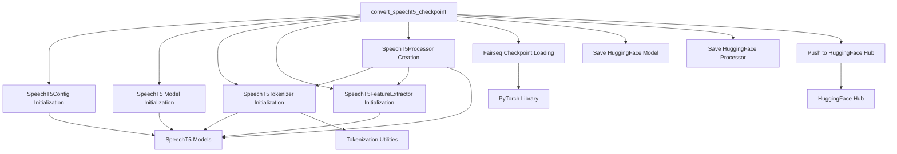

# SpeechT5 Checkpoint Conversion Module

## Introduction

This module, `speecht5_checkpoint_conversion`, is a specialized sub-module within the `speecht5_models` package. Its primary purpose is to convert original SpeechT5 PyTorch checkpoints (e.g., from Fairseq) into a format compatible with the Hugging Face Transformers library. This conversion is crucial for enabling the seamless integration and further utilization of pre-trained SpeechT5 models within the Hugging Face ecosystem, allowing developers to leverage existing models with the full suite of Transformers' functionalities.

## Core Functionality

The central component of this module is the `convert_speecht5_checkpoint` function, which orchestrates the entire conversion process. This function performs several key operations:

*   **Configuration Adaptation**: It initializes the `SpeechT5Config` based on the specified task (speech-to-text, text-to-speech, or speech-to-speech) and adjusts relevant parameters such as `max_length`, `max_speech_positions`, and `max_text_positions` to align with Hugging Face's requirements.
*   **Model Initialization**: It instantiates the appropriate Hugging Face SpeechT5 model class (e.g., `SpeechT5ForSpeechToText`, `SpeechT5ForTextToSpeech`, or `SpeechT5ForSpeechToSpeech`) using the prepared configuration.
*   **Tokenizer and Feature Extractor Setup**: It creates a `SpeechT5Tokenizer` (if a vocabulary path is provided) and a `SpeechT5FeatureExtractor`. These are then combined to form a `SpeechT5Processor`, which is essential for unified input data handling.
*   **Weight Loading**: It loads the weights from the original Fairseq PyTorch checkpoint. A `recursively_load_weights` helper function (not detailed here but implicitly used) maps these weights to the corresponding layers of the newly initialized Hugging Face model.
*   **Saving Converted Assets**: It saves the converted Hugging Face model and processor to a specified output directory, making them ready for use.
*   **Hugging Face Hub Integration**: Optionally, it can push the converted model and processor to the Hugging Face Hub, facilitating public sharing and accessibility.

## Architecture and Component Relationships

The `speecht5_checkpoint_conversion` module interacts with various internal SpeechT5-specific components and external libraries to perform the conversion. The following diagram illustrates these relationships:

<!-- DIAGRAM_JSON
{
    "direction": "TD",
    "nodes": [
        {"id": "convert_func", "label": "convert_speecht5_checkpoint", "type": "component", "link": null},
        {"id": "config_init", "label": "SpeechT5Config Initialization", "type": "component", "link": null},
        {"id": "model_init", "label": "SpeechT5 Model Initialization", "type": "component", "link": null},
        {"id": "tokenizer_init", "label": "SpeechT5Tokenizer Initialization", "type": "component", "link": null},
        {"id": "feature_extractor_init", "label": "SpeechT5FeatureExtractor Initialization", "type": "component", "link": null},
        {"id": "processor_creation", "label": "SpeechT5Processor Creation", "type": "component", "link": null},
        {"id": "weight_loading", "label": "Fairseq Checkpoint Loading", "type": "component", "link": null},
        {"id": "model_saving", "label": "Save HuggingFace Model", "type": "component", "link": null},
        {"id": "processor_saving", "label": "Save HuggingFace Processor", "type": "component", "link": null},
        {"id": "push_to_hub_action", "label": "Push to HuggingFace Hub", "type": "component", "link": null},
        {"id": "speecht5_parent_module", "label": "SpeechT5 Models", "type": "external", "link": "speecht5_models.md"},
        {"id": "tokenization_utilities_module", "label": "Tokenization Utilities", "type": "external", "link": "tokenization_utilities.md"},
        {"id": "pytorch_library", "label": "PyTorch Library", "type": "external", "link": null},
        {"id": "huggingface_hub_module", "label": "HuggingFace Hub", "type": "external", "link": null}
    ],
    "edges": [
        {"source": "convert_func", "target": "config_init"},
        {"source": "convert_func", "target": "model_init"},
        {"source": "convert_func", "target": "tokenizer_init"},
        {"source": "convert_func", "target": "feature_extractor_init"},
        {"source": "convert_func", "target": "processor_creation"},
        {"source": "convert_func", "target": "weight_loading"},
        {"source": "convert_func", "target": "model_saving"},
        {"source": "convert_func", "target": "processor_saving"},
        {"source": "convert_func", "target": "push_to_hub_action"},
        {"source": "config_init", "target": "speecht5_parent_module"},
        {"source": "model_init", "target": "speecht5_parent_module"},
        {"source": "tokenizer_init", "target": "speecht5_parent_module"},
        {"source": "tokenizer_init", "target": "tokenization_utilities_module"},
        {"source": "feature_extractor_init", "target": "speecht5_parent_module"},
        {"source": "processor_creation", "target": "tokenizer_init"},
        {"source": "processor_creation", "target": "feature_extractor_init"},
        {"source": "processor_creation", "target": "speecht5_parent_module"},
        {"source": "weight_loading", "target": "pytorch_library"},
        {"source": "push_to_hub_action", "target": "huggingface_hub_module"}
    ],
    "groups": []
}
-->

### Component Relationships

*   **`convert_speecht5_checkpoint`**: This is the core function of the module, responsible for orchestrating the entire conversion workflow. It directly interacts with all other internal components.
*   **`SpeechT5Config Initialization`**: This component handles the creation of the `SpeechT5Config` object, which defines the model's architecture and is intrinsically linked to the [SpeechT5 Models](speecht5_models.md) module.
*   **`SpeechT5 Model Initialization`**: Based on the specific task (e.g., s2t, t2s, s2s) and the configured `SpeechT5Config`, the appropriate SpeechT5 model class from the [SpeechT5 Models](speecht5_models.md) module is instantiated.
*   **`SpeechT5Tokenizer Initialization`**: An instance of `SpeechT5Tokenizer` is created. While specific to SpeechT5, it utilizes general tokenization principles and potentially components from the [Tokenization Utilities](tokenization_utilities.md) module (e.g., `AddedToken`).
*   **`SpeechT5FeatureExtractor Initialization`**: This component instantiates the `SpeechT5FeatureExtractor`, which is responsible for processing audio inputs and is closely tied to the [SpeechT5 Models](speecht5_models.md) module.
*   **`SpeechT5Processor Creation`**: This component combines the `SpeechT5Tokenizer` and `SpeechT5FeatureExtractor` into a single `SpeechT5Processor` object, providing a unified interface for pre-processing input data. It is an integral part of the [SpeechT5 Models](speecht5_models.md) ecosystem.
*   **`Fairseq Checkpoint Loading`**: This step involves loading the raw model weights from the original Fairseq checkpoint using the functionalities provided by the [PyTorch Library](https://pytorch.org/).
*   **`Save HuggingFace Model` and `Save HuggingFace Processor`**: These components are responsible for serializing and saving the fully converted Hugging Face model and processor to a designated directory.
*   **`Push to HuggingFace Hub`**: This optional but valuable component enables the converted model and processor to be uploaded and shared on the [Hugging Face Hub](https://huggingface.co/docs/hub/en/index).

## How the Module Fits into the Overall System

The `speecht5_checkpoint_conversion` module is a vital bridge that connects SpeechT5 models trained in their original framework (e.g., Fairseq) with the Hugging Face Transformers ecosystem. Its strategic placement within the `speecht5_models` package highlights its specialized role in supporting the SpeechT5 model family.

This module contributes significantly to:

*   **Enhanced Model Interoperability**: It allows researchers and developers to easily import and utilize SpeechT5 models trained outside the Hugging Face framework, fostering a more open and collaborative environment.
*   **Streamlined Development Workflow**: By converting models to the standard Hugging Face format, it enables developers to leverage the extensive tools, utilities, and fine-tuning capabilities offered by the Transformers library without manual adaptation.
*   **Community and Ecosystem Growth**: It facilitates the sharing of pre-trained SpeechT5 models on the Hugging Face Hub, expanding the available resources for various speech processing tasks and encouraging broader adoption and innovation.