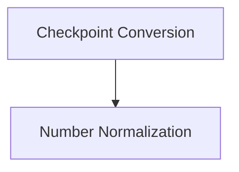

# SpeechT5 Models Documentation

## Introduction

The `speecht5_models` module provides the core components for SpeechT5, a powerful text-to-speech, speech-to-text, and speech-to-speech model. This module includes utilities for converting checkpoints from the original PyTorch implementation to the Hugging Face Transformers format, as well as a robust English number normalizer for text processing.

## Architecture Overview

The `speecht5_models` module is composed of two main sub-modules:

1. **Checkpoint Conversion**: Manages the conversion of original PyTorch checkpoints to a compatible format for the Hugging Face Transformers library.
2. **Number Normalization**: Provides functionality to convert numerical values in English text into their word-based representations.

<!-- DIAGRAM_JSON
{
    "direction": "TD",
    "nodes": [
        {"id": "checkpoint_conversion", "label": "Checkpoint Conversion", "type": "module", "link": "checkpoint_conversion.md"},
        {"id": "number_normalization", "label": "Number Normalization", "type": "module", "link": "number_normalization.md"}
    ],
    "edges": [
        {"source": "checkpoint_conversion", "target": "number_normalization", "label": "utilizes"}
    ],
    "groups": []
}
-->

## Sub-modules

### [Checkpoint Conversion](checkpoint_conversion.md)
This sub-module focuses on the `convert_speecht5_checkpoint` utility, which is essential for adapting pre-trained SpeechT5 models from their original implementation into the Hugging Face Transformers ecosystem. It handles the mapping and loading of model weights, ensuring compatibility and ease of use within the Transformers framework.

### [Number Normalization](number_normalization.md)
This sub-module contains the `EnglishNumberNormalizer` class, a critical component for processing text inputs. It converts numerical expressions (e.g., "123", "$50.25", "20%") into their natural language equivalents ("one hundred twenty-three", "fifty point two five dollars", "twenty percent"), which is crucial for high-quality text-to-speech synthesis and other natural language processing tasks.