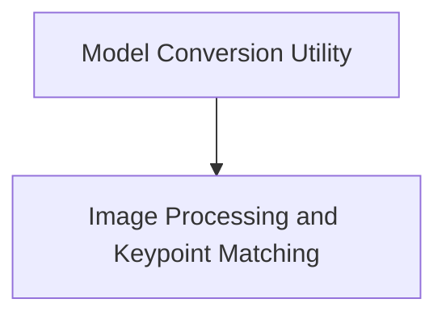

# SuperGlue Models Documentation

## Introduction

The `superglue_models` module provides the necessary components for working with SuperGlue models, primarily focusing on model conversion from original checkpoints to Hugging Face format and image processing functionalities for keypoint matching.

## Architecture Overview

The `superglue_models` module is composed of two main sub-modules:

- **Model Conversion Utility**: Responsible for converting pre-trained SuperGlue model weights to a format compatible with the Hugging Face Transformers library.
- **Image Processing and Keypoint Matching**: Handles the preprocessing of images for SuperGlue models, post-processing of model outputs for keypoint matching, and visualization of these matches.

These sub-modules interact to provide a complete pipeline for utilizing SuperGlue models, from initial setup to result visualization.

<!-- DIAGRAM_JSON
{
    "direction": "TD",
    "nodes": [
        {"id": "model_conversion", "label": "Model Conversion Utility", "type": "module", "link": "model_conversion.md"},
        {"id": "image_processing", "label": "Image Processing and Keypoint Matching", "type": "module", "link": "image_processing.md"}
    ],
    "edges": [
        {"source": "model_conversion", "target": "image_processing"}
    ],
    "groups": []
}
-->

## Sub-modules

### [Model Conversion Utility](model_conversion.md)

This sub-module contains the logic for converting SuperGlue model checkpoints to the Hugging Face format, making them compatible with the Transformers library. It includes utilities for fetching original weights, transforming key names, and saving the converted model.

### [Image Processing and Keypoint Matching](image_processing.md)

This sub-module provides tools for preparing images for inference with SuperGlue models, including resizing, rescaling, and grayscale conversion. It also offers advanced functionalities for post-processing the model's raw outputs to extract keypoints, scores, and matches, and for visualizing these keypoint matches on images.