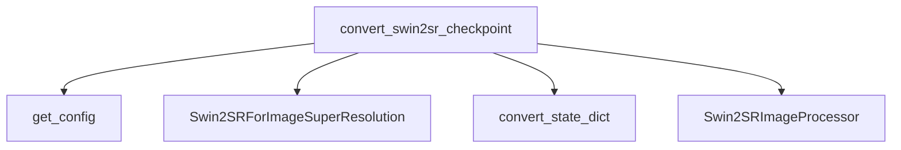

The `swin2sr_models` module is a crucial component for integrating Swin2SR models within the system, focusing on image super-resolution tasks. Its primary purpose is to facilitate the conversion of pre-trained Swin2SR checkpoints into a PyTorch-compatible format, making these powerful models readily usable for various applications. This module also encompasses the core Swin2SR model architecture and its associated image processing utilities, ensuring a complete and functional package for super-resolution tasks.

### Core Functionality

The main functionality of this module revolves around the `convert_swin2sr_checkpoint` function. This function is responsible for:

1.  **Loading Configuration**: It retrieves the appropriate configuration for the Swin2SR model based on the provided checkpoint URL.
2.  **Model Initialization**: It initializes a `Swin2SRForImageSuperResolution` model using the loaded configuration.
3.  **State Dictionary Conversion**: It loads the original Swin2SR checkpoint's state dictionary and converts it to a format compatible with the `Swin2SRForImageSuperResolution` model.
4.  **Weight Loading and Verification**: The converted state dictionary is then loaded into the PyTorch model. A rigorous verification process follows, including checking for missing or unexpected keys in the state dictionary and asserting the output shape and values against expected benchmarks for different Swin2SR variants. This ensures the integrity and correctness of the conversion.
5.  **Image Processing Setup**: It initializes a `Swin2SRImageProcessor` and applies necessary image transformations (resizing, normalization) to prepare input images for the model.
6.  **Model Saving and Hub Integration**: Optionally, the converted model and its image processor can be saved to a specified folder or pushed to a model hub for wider accessibility.

### Architecture and Component Relationships

The `swin2sr_models` module, while being a leaf module in the repository structure, conceptually brings together several key internal components to achieve its super-resolution capabilities. The `convert_swin2sr_checkpoint` function acts as the central orchestrator, leveraging other components for configuration, state dictionary transformation, model architecture, and image preprocessing.

<!-- DIAGRAM_JSON
{
    "direction": "TD",
    "nodes": [
        {"id": "convert_swin2sr_checkpoint", "label": "convert_swin2sr_checkpoint", "type": "component", "link": null},
        {"id": "Swin2SRForImageSuperResolution", "label": "Swin2SRForImageSuperResolution", "type": "component", "link": null},
        {"id": "Swin2SRImageProcessor", "label": "Swin2SRImageProcessor", "type": "component", "link": null},
        {"id": "get_config", "label": "get_config", "type": "component", "link": null},
        {"id": "convert_state_dict", "label": "convert_state_dict", "type": "component", "link": null}
    ],
    "edges": [
        {"source": "convert_swin2sr_checkpoint", "target": "get_config"},
        {"source": "convert_swin2sr_checkpoint", "target": "Swin2SRForImageSuperResolution"},
        {"source": "convert_swin2sr_checkpoint", "target": "convert_state_dict"},
        {"source": "convert_swin2sr_checkpoint", "target": "Swin2SRImageProcessor"}
    ],
    "groups": []
}
-->

*   **`convert_swin2sr_checkpoint`**: The primary function for orchestrating the conversion and verification process.
*   **`Swin2SRForImageSuperResolution`**: Represents the core Swin2SR model architecture, responsible for performing image super-resolution.
*   **`Swin2SRImageProcessor`**: Handles image preprocessing steps, such as resizing, normalization, and converting images to tensor format, before they are fed into the model.
*   **`get_config`**: A helper function responsible for fetching the model configuration.
*   **`convert_state_dict`**: A helper function that transforms the original model's state dictionary into a format compatible with the PyTorch implementation.

### System Integration

The `swin2sr_models` module plays a vital role in enabling the use of Swin2SR models within the larger system. By providing a robust conversion mechanism, it allows users to leverage pre-trained Swin2SR weights, streamlining the process of deploying these models for image super-resolution tasks.

Developers can use this module to:
*   Load official Swin2SR checkpoints and convert them into the system's native PyTorch model format.
*   Ensure the correctness of the converted models through built-in verification steps.
*   Easily integrate Swin2SR models into pipelines that require image super-resolution, by providing a pre-configured model and processor.

The output models from this module can be directly used for inference, providing high-quality upscaled images. The associated `Swin2SRImageProcessor` ensures that input images are correctly prepared, maintaining consistency and optimizing performance.