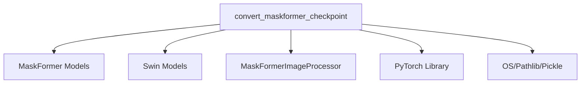

# swin_conversion Module Documentation

The `swin_conversion` module is a vital part of the MaskFormer model ecosystem, specifically designed to facilitate the conversion of pre-trained MaskFormer models that utilize a Swin Transformer backbone. This ensures interoperability and seamless integration with the Hugging Face Transformers library.

### Module Purpose and Core Functionality

The primary purpose of this module is to convert original MaskFormer model checkpoints (with a Swin backbone) into a format compatible with the `MaskFormerForInstanceSegmentation` model within the Hugging Face Transformers framework.

The core functionality is encapsulated in the `convert_maskformer_checkpoint` function:

#### `convert_maskformer_checkpoint`

```python
def convert_maskformer_checkpoint(
    model_name: str, checkpoint_path: str, pytorch_dump_folder_path: str, push_to_hub: bool = False
):
    """
    Copy/paste/tweak model's weights to our MaskFormer structure.
    """
    # ... (code details)
```

**Parameters**:

*   `model_name` (`str`): The name of the MaskFormer model, used to retrieve the appropriate configuration.
*   `checkpoint_path` (`str`): The file path to the original MaskFormer model checkpoint (a pickled file).
*   `pytorch_dump_folder_path` (`str`): The directory where the converted PyTorch model and image processor will be saved.
*   `push_to_hub` (`bool`, *optional*, defaults to `False`): Whether to push the converted model and image processor to the Hugging Face Hub.

**Process**:

1.  **Configuration Loading**: Retrieves the MaskFormer model configuration based on `model_name`.
2.  **Checkpoint Loading**: Loads the original model's state dictionary from the provided `checkpoint_path` using `pickle.load`. **Note:** This operation involves deserializing Python objects and can be insecure if the data originates from an untrusted source, or could have been tampered with. Users are warned and must explicitly set the `TRUST_REMOTE_CODE` environment variable to `True` to proceed.
3.  **Key Renaming**: Transforms the keys in the loaded state dictionary to match the naming conventions of the Hugging Face `MaskFormerForInstanceSegmentation` model. This involves specific renaming rules for both the Swin backbone and the MaskFormer decoder's query/key/value layers.
4.  **Tensor Conversion**: Converts all numpy arrays in the state dictionary to PyTorch tensors.
5.  **Model Instantiation and Loading**: Initializes a `MaskFormerForInstanceSegmentation` model with the loaded configuration and then loads the prepared state dictionary into it.
6.  **Verification**: Conducts a basic verification by preparing a sample image with `MaskFormerImageProcessor`, passing it through the converted model, and asserting against expected output logits for specific model names (e.g., "maskformer-swin-tiny-ade").
7.  **Saving and Pushing**: Optionally saves the converted model and its corresponding `MaskFormerImageProcessor` to `pytorch_dump_folder_path` and/or pushes them to the Hugging Face Hub.

### Architecture and Component Relationships

The `swin_conversion` module, particularly the `convert_maskformer_checkpoint` function, acts as a bridge between the original MaskFormer Swin implementations and the Hugging Face Transformers library. It orchestrates the process of adapting model weights to a new architecture.

<!-- DIAGRAM_JSON
{
    "direction": "TD",
    "nodes": [
        {"id": "convert_maskformer_checkpoint", "label": "convert_maskformer_checkpoint", "type": "component", "link": null},
        {"id": "maskformer_models", "label": "MaskFormer Models", "type": "external", "link": "maskformer_models.md"},
        {"id": "swin_models", "label": "Swin Models", "type": "external", "link": "swin_models.md"},
        {"id": "image_processor", "label": "MaskFormerImageProcessor", "type": "external", "link": "maskformer_models.md"},
        {"id": "pytorch_lib", "label": "PyTorch Library", "type": "external", "link": null},
        {"id": "os_pathlib_pickle", "label": "OS/Pathlib/Pickle", "type": "external", "link": null}
    ],
    "edges": [
        {"source": "convert_maskformer_checkpoint", "target": "maskformer_models"},
        {"source": "convert_maskformer_checkpoint", "target": "swin_models"},
        {"source": "convert_maskformer_checkpoint", "target": "image_processor"},
        {"source": "convert_maskformer_checkpoint", "target": "pytorch_lib"},
        {"source": "convert_maskformer_checkpoint", "target": "os_pathlib_pickle"}
    ],
    "groups": []
}
-->


*   **`convert_maskformer_checkpoint`**: The central function within this module, responsible for the entire conversion process.
*   **[MaskFormer Models](maskformer_models.md)**: This external dependency provides the `MaskFormerForInstanceSegmentation` model class, model configurations (via `get_maskformer_config`), and potentially utility functions for key renaming (`create_rename_keys`, `rename_key`, `read_in_swin_q_k_v`, `read_in_decoder_q_k_v`) that are crucial for adapting the original weights.
*   **[Swin Models](swin_models.md)**: While not directly instantiated, the `swin_models` module is implicitly referenced as the backbone architecture for the MaskFormer model being converted. The conversion logic specifically handles Swin Transformer-related weight adjustments.
*   **[MaskFormerImageProcessor](maskformer_models.md)**: This component, also part of the `maskformer_models` ecosystem, is used during the verification step to preprocess input images, ensuring the converted model functions correctly with the expected input format.
*   **PyTorch Library**: Provides fundamental tensor operations and the `torch.from_numpy` function for converting loaded weights.
*   **OS/Pathlib/Pickle**: Standard Python libraries used for environment variable access (`os`), path manipulation (`pathlib.Path`), and deserializing the original model checkpoint (`pickle`).

### How the Module Fits into the Overall System

The `swin_conversion` module is a specialized component nested within the `maskformer_models` module's `conversion_utilities`. It exists to specifically handle MaskFormer models that leverage the Swin Transformer as their backbone. This specialization ensures that the unique architectural characteristics and weight naming conventions of Swin-based MaskFormer models are correctly addressed during the conversion process.

It plays a critical role in expanding the range of pre-trained MaskFormer models available within the Hugging Face ecosystem, allowing users to easily load and utilize models that were originally trained in a different framework. By providing a dedicated conversion path, it reduces the effort required to port and deploy these models.
