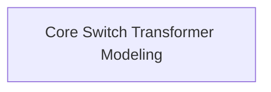

# Switch Transformer Models

## Introduction

The `switch_transformer_models` module provides implementations of the Switch Transformer architecture, a type of Transformer model that utilizes a Mixture-of-Experts (MoE) layer in its feed-forward networks. This allows the model to dynamically activate different "experts" for different tokens, leading to increased model capacity without a proportional increase in computational cost during inference.

This module contains the core components for building and using Switch Transformer models, including both encoder-decoder and encoder-only variants.

## Architecture Overview

The Switch Transformer architecture extends the standard Transformer by replacing the dense feed-forward network (FFN) with a Mixture-of-Experts (MoE) layer. This layer consists of a router and several expert FFNs. For each token, the router selects a subset of experts to process the token, allowing for conditional computation. The outputs from the selected experts are then combined.

The `switch_transformer_models` module is structured to provide the foundational modeling components. The key sub-module, `core_switch_transformer_modeling`, encapsulates the primary model implementations.

<!-- DIAGRAM_JSON
{
    "direction": "TD",
    "nodes": [
        {"id": "core_switch_transformer_modeling", "label": "Core Switch Transformer Modeling", "type": "module", "link": "core_switch_transformer_modeling.md"}
    ],
    "edges": [],
    "groups": []
}
-->

## Sub-modules

### [Core Switch Transformer Modeling](core_switch_transformer_modeling.md)
This sub-module contains the fundamental implementations of the Switch Transformer, including the full encoder-decoder model and a dedicated encoder model. It provides the building blocks for sequence-to-sequence and encoder-only tasks using the Switch Transformer architecture.