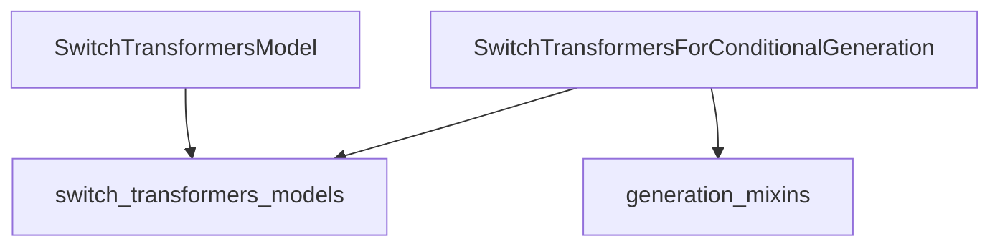

# switch_transformers_implementations

The `switch_transformers_implementations` module provides the core model architectures for the Switch Transformers, a type of Mixture-of-Experts (MoE) transformer model. It includes implementations for the base encoder-decoder model and a model specifically designed for conditional generation tasks, incorporating advanced features like router loss calculation to manage expert utilization.

## Architecture and Component Relationships

This module encapsulates two primary model implementations: `SwitchTransformersModel` for general sequence-to-sequence tasks and `SwitchTransformersForConditionalGeneration` for tasks requiring text generation. Both models build upon shared embeddings, an encoder stack, and a decoder stack, characteristic of the Switch Transformer architecture.

`SwitchTransformersForConditionalGeneration` extends the base Switch Transformer model with a language modeling head and integrates `GenerationMixin` for enhanced generation capabilities. It also explicitly handles the computation of router Z-loss and auxiliary loss, which are crucial for optimizing expert routing in MoE models.

### Diagram

<!-- DIAGRAM_JSON
{
    "direction": "TD",
    "nodes": [
        {"id": "switch_transformers_for_conditional_generation", "label": "SwitchTransformersForConditionalGeneration", "type": "component", "link": null},
        {"id": "switch_transformers_model", "label": "SwitchTransformersModel", "type": "component", "link": null},
        {"id": "switch_transformers_models", "label": "switch_transformers_models", "type": "external", "link": "switch_transformers_models.md"},
        {"id": "generation_mixins", "label": "generation_mixins", "type": "external", "link": "generation_mixins.md"}
    ],
    "edges": [
        {"source": "switch_transformers_for_conditional_generation", "target": "switch_transformers_models"},
        {"source": "switch_transformers_for_conditional_generation", "target": "generation_mixins"},
        {"source": "switch_transformers_model", "target": "switch_transformers_models"}
    ],
    "groups": []
}
-->

### Core Components

#### `SwitchTransformersForConditionalGeneration`

This class is designed for conditional text generation using the Switch Transformer architecture. It includes a shared embedding layer, an encoder, a decoder, and a language modeling head. It specifically implements the forward pass for generation tasks, handling decoder input preparation and computing both the standard cross-entropy loss and the router-specific Z-loss and auxiliary loss to ensure efficient expert utilization.

- **Base Classes**: `SwitchTransformersPreTrainedModel`, `GenerationMixin`
- **Key Features**:
    - Encoder-decoder architecture using `SwitchTransformersStack`.
    - Shared word embeddings across encoder, decoder, and language modeling head.
    - Computes router Z-loss and auxiliary loss, essential for training Mixture-of-Experts models.
    - Supports standard conditional generation workflow, including shifting labels for decoder input.

#### `SwitchTransformersModel`

This class represents the base encoder-decoder Switch Transformer model. It provides the core architecture without a specific head for tasks like language modeling. It uses shared embeddings and comprises an encoder stack and a decoder stack. This model is foundational and can be used as a backbone for various sequence-to-sequence tasks.

- **Base Class**: `SwitchTransformersPreTrainedModel`
- **Key Features**:
    - Encoder-decoder architecture using `SwitchTransformersStack`.
    - Shared word embeddings.
    - Provides the hidden states from both encoder and decoder, along with router logits.

## How the Module Fits into the Overall System

The `switch_transformers_implementations` module is a critical part of the larger [switch_transformers_models](switch_transformers_models.md) ecosystem. It provides the concrete implementations of the Switch Transformer models, which are a specialized form of transformer known for their Mixture-of-Experts (MoE) design, enabling efficient scaling to very large models.

- **Dependency on `switch_transformers_models`**: Both `SwitchTransformersForConditionalGeneration` and `SwitchTransformersModel` rely heavily on components defined within the broader `switch_transformers_models` module, such as `SwitchTransformersConfig`, `SwitchTransformersPreTrainedModel`, and `SwitchTransformersStack`. These components define the fundamental building blocks and configuration for the Switch Transformer architecture.
- **Integration with `generation_mixins`**: `SwitchTransformersForConditionalGeneration` leverages the [generation_mixins](generation_mixins.md) module to inherit common methods and functionalities required for text generation, ensuring consistent and efficient generation behavior across different models.

This module's implementations are designed to be used as core model classes within a larger machine learning pipeline, where they can be loaded, fine-tuned, and used for inference on various sequence-to-sequence tasks, particularly those benefiting from the sparse activation patterns of MoE models.