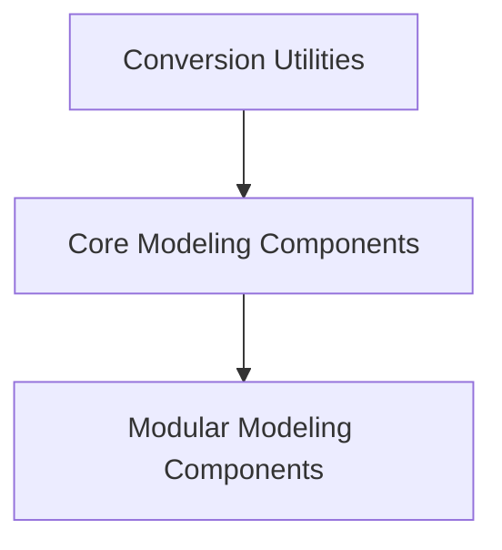

# Switch Transformers Models

## Introduction
The `switch_transformers_models` module provides implementations and utilities for the Switch Transformers architecture, a type of Mixture-of-Experts (MoE) model. This module includes core modeling components, modular adaptations, and tools for checkpoint conversion, enabling the use of Switch Transformers for various conditional generation and encoder-only tasks.

## Architecture Overview
The Switch Transformers module is structured into several key sub-modules that handle different aspects of the model's lifecycle and functionality. This includes utilities for converting checkpoints from other frameworks (like Flax) to PyTorch, core implementations of the model architecture, and modular components for flexible integration.

<!-- DIAGRAM_JSON
{
    "direction": "TD",
    "nodes": [
        {"id": "conversion_utilities", "label": "Conversion Utilities", "type": "module", "link": "conversion_utilities.md"},
        {"id": "core_modeling", "label": "Core Modeling Components", "type": "module", "link": "core_modeling.md"},
        {"id": "modular_modeling", "label": "Modular Modeling Components", "type": "module", "link": "modular_modeling.md"}
    ],
    "edges": [
        {"source": "conversion_utilities", "target": "core_modeling"},
        {"source": "core_modeling", "target": "modular_modeling"}
    ],
    "groups": []
}
-->

## Sub-modules

### [Conversion Utilities](conversion_utilities.md)
This sub-module contains utilities for converting Switch Transformers model checkpoints from other frameworks (e.g., Flax) to the PyTorch format. This is crucial for interoperability and leveraging pre-trained models.

### [Core Modeling Components](core_modeling.md)
This section defines the fundamental Switch Transformers model architectures, including specialized models for conditional generation, the base encoder-decoder model, and an encoder-only variant. These components form the backbone of the Switch Transformers' functionality.

### [Modular Modeling Components](modular_modeling.md)
This sub-module provides modular implementations of the Switch Transformers base model and its encoder-only architecture. These components are designed for flexibility and ease of integration into larger systems, allowing developers to build custom configurations.
