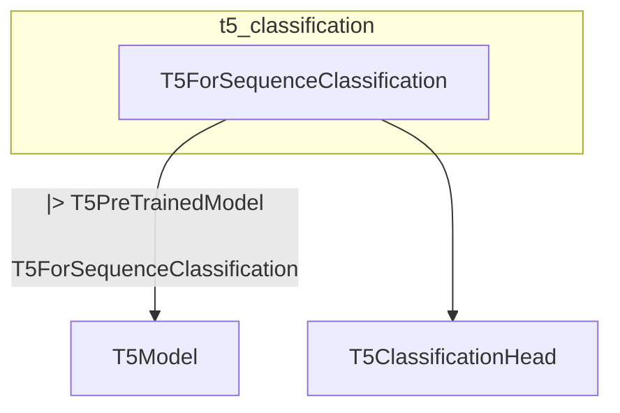

# t5_classification
This module provides the `T5ForSequenceClassification` class, a T5 model specifically designed for sequence classification tasks. It extends `T5PreTrainedModel` and integrates a T5 encoder-decoder with a classification head.

<!-- DIAGRAM_JSON
{
  "nodes": [
    {
      "id": "T5ForSequenceClassification",
      "label": "T5ForSequenceClassification",
      "url": "src.transformers.models.t5.modeling_t5.T5ForSequenceClassification"
    },
    {
      "id": "T5PreTrainedModel",
      "label": "T5PreTrainedModel"
    },
    {
      "id": "T5Model",
      "label": "T5Model"
    },
    {
      "id": "T5ClassificationHead",
      "label": "T5ClassificationHead"
    }
  ],
  "edges": [
    {
      "source": "T5ForSequenceClassification",
      "target": "T5PreTrainedModel",
      "type": "inheritance"
    },
    {
      "source": "T5ForSequenceClassification",
      "target": "T5Model",
      "type": "composition"
    },
    {
      "source": "T5ForSequenceClassification",
      "target": "T5ClassificationHead",
      "type": "composition"
    }
  ],
  "groups": [
    {
      "id": "t5_classification",
      "label": "t5_classification",
      "nodes": ["T5ForSequenceClassification"]
    }
  ]
}
-->
