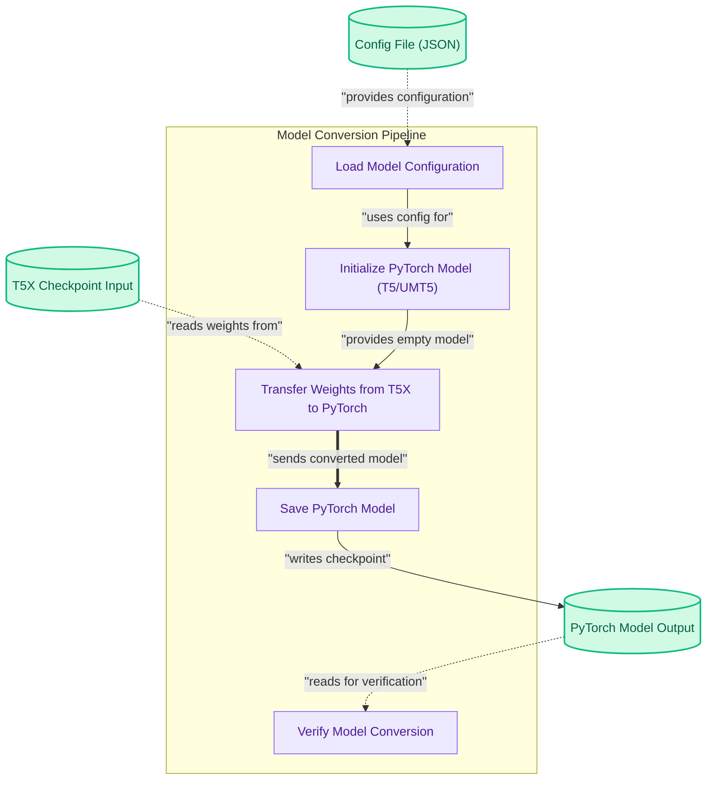

# T5 Family Checkpoint Converters

This module converts T5 and UMT5 family model checkpoints from T5X format to PyTorch, enabling seamless model migration and compatibility across frameworks for further use.

<!-- DIAGRAM_JSON
{
    "direction": "TD",
    "nodes": [
        {"id": "t5x_checkpoint_input", "label": "T5X Checkpoint Input", "type": "data", "link": null},
        {"id": "config_json_input", "label": "Config File (JSON)", "type": "data", "link": null},
        {"id": "load_model_config", "label": "Load Model Configuration", "type": "component", "link": null},
        {"id": "init_pytorch_model", "label": "Initialize PyTorch Model (T5/UMT5)", "type": "component", "link": null},
        {"id": "transfer_weights", "label": "Transfer Weights from T5X to PyTorch", "type": "component", "link": null},
        {"id": "save_model", "label": "Save PyTorch Model", "type": "component", "link": null},
        {"id": "verify_conversion", "label": "Verify Model Conversion", "type": "component", "link": null},
        {"id": "pytorch_model_output", "label": "PyTorch Model Output", "type": "data", "link": null}
    ],
    "edges": [
        {"source": "t5x_checkpoint_input", "target": "transfer_weights", "label": "reads weights from"},
        {"source": "config_json_input", "target": "load_model_config", "label": "provides configuration"},
        {"source": "load_model_config", "target": "init_pytorch_model", "label": "uses config for"},
        {"source": "init_pytorch_model", "target": "transfer_weights", "label": "provides empty model"},
        {"source": "transfer_weights", "target": "save_model", "label": "sends converted model"},
        {"source": "save_model", "target": "pytorch_model_output", "label": "writes checkpoint"},
        {"source": "pytorch_model_output", "target": "verify_conversion", "label": "reads for verification"}
    ],
    "groups": [
        {"id": "conversion_pipeline", "label": "Model Conversion Pipeline", "role": "analytical", "nodes": ["load_model_config", "init_pytorch_model", "transfer_weights", "save_model", "verify_conversion"]}
    ]
}
-->

