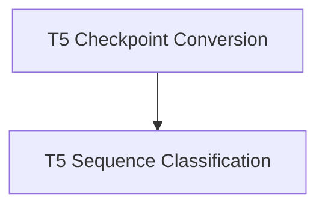

# T5 Models Documentation

## Introduction
The `t5_models` module provides implementations and utilities for working with T5 (Text-to-Text Transfer Transformer) models. It includes functionalities for converting checkpoints from T5X to PyTorch and adapting the T5 architecture for sequence classification tasks.

## Architecture Overview
The `t5_models` module is composed of two main sub-modules:

- **Checkpoint Conversion**: Manages the conversion process of T5X checkpoints to be compatible with PyTorch.
- **Sequence Classification**: Provides a specialized T5 model for handling sequence classification tasks.

<!-- DIAGRAM_JSON
{
    "direction": "TD",
    "nodes": [
        {"id": "checkpoint_conversion", "label": "T5 Checkpoint Conversion", "type": "module", "link": "checkpoint_conversion.md"},
        {"id": "sequence_classification", "label": "T5 Sequence Classification", "type": "module", "link": "sequence_classification.md"}
    ],
    "edges": [
        {"source": "checkpoint_conversion", "target": "sequence_classification", "label": "influences"}
    ],
    "groups": []
}
-->

## Sub-modules

### [T5 Checkpoint Conversion](checkpoint_conversion.md)
This sub-module focuses on the utility for converting T5X model checkpoints to a PyTorch-compatible format. This is essential for interoperability between different deep learning frameworks, allowing models trained in T5X to be used within a PyTorch environment.

### [T5 Sequence Classification](sequence_classification.md)
This sub-module provides a `T5ForSequenceClassification` class, which extends the base T5 model to perform sequence classification tasks. It includes the necessary forward pass logic and handles the computation of various loss functions depending on the problem type (regression, single-label, or multi-label classification).