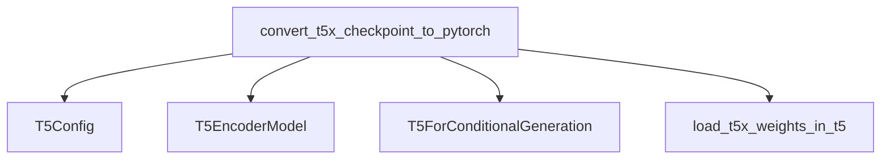

# T5 Models Checkpoint Conversion Module

This documentation outlines the `checkpoint_conversion` module specifically for `t5_models`. This module is crucial for enabling interoperability between models trained in the T5X framework and their PyTorch counterparts.

## Purpose and Core Functionality

The primary purpose of the `checkpoint_conversion` module for T5 models is to facilitate the conversion of pre-trained T5X model checkpoints into a format compatible with PyTorch. This allows users to seamlessly load and utilize models originally developed in T5X within PyTorch environments, leveraging the flexibility and extensive tooling of the PyTorch ecosystem.

The core functionality is encapsulated in the `convert_t5x_checkpoint_to_pytorch` function, which performs the following steps:

1.  **Configuration Loading**: Reads the model configuration from a specified JSON file to initialize the PyTorch model structure.
2.  **Model Initialization**: Instantiates either a `T5EncoderModel` or `T5ForConditionalGeneration` PyTorch model based on the provided configuration and whether the model is encoder-only.
3.  **Weight Loading**: Transfers the weights from the T5X checkpoint file to the newly initialized PyTorch model. This involves mapping the T5X's parameter names and structures to their PyTorch equivalents.
4.  **Model Saving**: Saves the converted PyTorch model to a specified directory, making it ready for future loading and use with standard PyTorch `from_pretrained` methods.
5.  **Verification**: Optionally verifies the successful conversion by attempting to load the newly saved PyTorch checkpoint.

## Architecture and Component Relationships

The `checkpoint_conversion` module for T5 models primarily interacts with T5 model components for configuration and model instantiation. Its main function orchestrates the conversion process.

<!-- DIAGRAM_JSON
{
    "direction": "TD",
    "nodes": [
        {"id": "convert_t5x_checkpoint_to_pytorch", "label": "convert_t5x_checkpoint_to_pytorch", "type": "component", "link": null},
        {"id": "t5_config", "label": "T5Config", "type": "external", "link": "t5_models.md"},
        {"id": "t5_encoder_model", "label": "T5EncoderModel", "type": "external", "link": "t5_models.md"},
        {"id": "t5_for_conditional_generation", "label": "T5ForConditionalGeneration", "type": "external", "link": "t5_models.md"},
        {"id": "load_t5x_weights_in_t5", "label": "load_t5x_weights_in_t5", "type": "component", "link": null}
    ],
    "edges": [
        {"source": "convert_t5x_checkpoint_to_pytorch", "target": "t5_config"},
        {"source": "convert_t5x_checkpoint_to_pytorch", "target": "t5_encoder_model"},
        {"source": "convert_t5x_checkpoint_to_pytorch", "target": "t5_for_conditional_generation"},
        {"source": "convert_t5x_checkpoint_to_pytorch", "target": "load_t5x_weights_in_t5"}
    ],
    "groups": []
}
-->

## How the module fits into the overall system

The `checkpoint_conversion` module plays a vital role in the broader T5 ecosystem by acting as a bridge between different deep learning frameworks. It ensures that models trained and saved in the T5X format can be seamlessly integrated into PyTorch-based applications. This enhances the flexibility and reach of T5 models, allowing researchers and developers to leverage their capabilities regardless of their preferred framework. It is particularly useful for migrating existing T5X models or for scenarios requiring fine-tuning or deployment within a PyTorch environment.