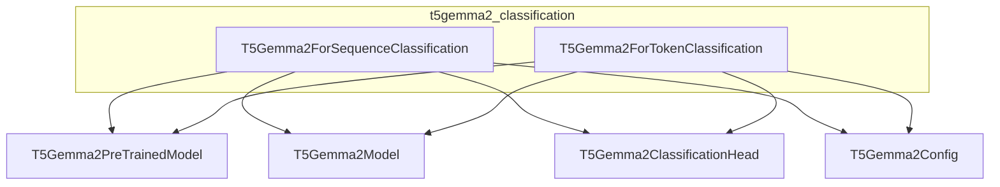

# t5gemma2_classification
This module provides classes for sequence and token classification tasks using the T5Gemma2 model architecture. It includes `T5Gemma2ForSequenceClassification` and `T5Gemma2ForTokenClassification`.

<!-- DIAGRAM_JSON
{
  "nodes": [
    {"id": "t5gemma2_classification", "label": "t5gemma2_classification", "type": "module"},
    {"id": "T5Gemma2ForSequenceClassification", "label": "T5Gemma2ForSequenceClassification", "type": "class"},
    {"id": "T5Gemma2ForTokenClassification", "label": "T5Gemma2ForTokenClassification", "type": "class"},
    {"id": "T5Gemma2PreTrainedModel", "label": "T5Gemma2PreTrainedModel", "type": "class"},
    {"id": "T5Gemma2Model", "label": "T5Gemma2Model", "type": "class"},
    {"id": "T5Gemma2ClassificationHead", "label": "T5Gemma2ClassificationHead", "type": "class"},
    {"id": "T5Gemma2Config", "label": "T5Gemma2Config", "type": "class"}
  ],
  "edges": [
    {"source": "T5Gemma2ForSequenceClassification", "target": "T5Gemma2PreTrainedModel", "type": "inherits"},
    {"source": "T5Gemma2ForTokenClassification", "target": "T5Gemma2PreTrainedModel", "type": "inherits"},
    {"source": "T5Gemma2ForSequenceClassification", "target": "T5Gemma2Model", "type": "uses"},
    {"source": "T5Gemma2ForSequenceClassification", "target": "T5Gemma2ClassificationHead", "type": "uses"},
    {"source": "T5Gemma2ForTokenClassification", "target": "T5Gemma2Model", "type": "uses"},
    {"source": "T5Gemma2ForTokenClassification", "target": "T5Gemma2ClassificationHead", "type": "uses"},
    {"source": "T5Gemma2ForSequenceClassification", "target": "T5Gemma2Config", "type": "config"},
    {"source": "T5Gemma2ForTokenClassification", "target": "T5Gemma2Config", "type": "config"}
  ],
  "groups": [
    {"id": "t5gemma2_classification_module", "label": "t5gemma2_classification", "nodes": ["T5Gemma2ForSequenceClassification", "T5Gemma2ForTokenClassification"]}
  ]
}
-->
```
