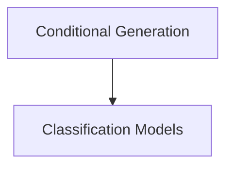

# T5Gemma2 Modeling Module Documentation

## Introduction

This document provides comprehensive documentation for the `t5gemma2_modeling` module, which implements various T5Gemma2 models for different natural language processing tasks. This module includes models for conditional generation, sequence classification, and token classification, all built upon the core T5Gemma2 architecture.

## Architecture Overview

The `t5gemma2_modeling` module is structured to provide clear separation of concerns for different modeling tasks. The core `T5Gemma2Model` (not directly covered in this module's core components but referenced by them) forms the backbone, with specialized heads added for specific applications such as conditional generation and various classification tasks.

<!-- DIAGRAM_JSON
{
    "direction": "TD",
    "nodes": [
        {"id": "conditional_generation", "label": "Conditional Generation", "type": "module", "link": "conditional_generation.md"},
        {"id": "classification_models", "label": "Classification Models", "type": "module", "link": "classification_models.md"}
    ],
    "edges": [
        {"source": "conditional_generation", "target": "classification_models"}
    ],
    "groups": []
}
-->

## Sub-modules

### [Conditional Generation](conditional_generation.md)
This sub-module focuses on models designed for conditional text generation tasks. It contains the `T5Gemma2ForConditionalGeneration` class, which extends the base T5Gemma2 model with a language modeling head to enable tasks like summarization, translation, and text completion.

### [Classification Models](classification_models.md)
This sub-module provides implementations for various classification tasks. It includes `T5Gemma2ForSequenceClassification` for tasks where the entire input sequence is classified (e.g., sentiment analysis) and `T5Gemma2ForTokenClassification` for tasks where each token in the sequence is classified (e.g., named entity recognition).