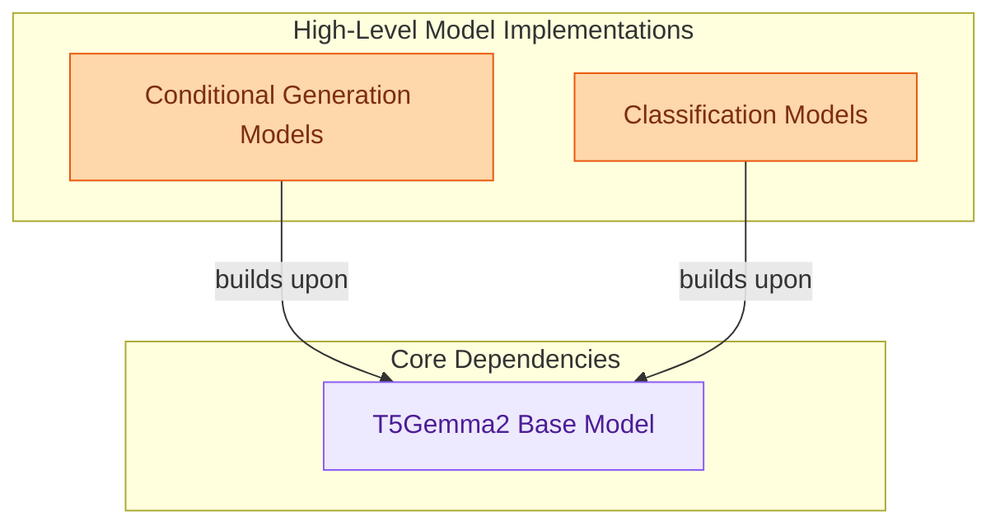

# T5Gemma2 Models
This module provides various T5Gemma2 model implementations for natural language processing, including models for conditional text generation, sequence classification, and token classification tasks.

<!-- DIAGRAM_JSON
{
    "direction": "TD",
    "nodes": [
        {"id": "conditional_generation", "label": "Conditional Generation Models", "type": "module", "link": "conditional_generation.md"},
        {"id": "classification_models", "label": "Classification Models", "type": "module", "link": "classification_models.md"},
        {"id": "base_t5gemma2_model", "label": "T5Gemma2 Base Model", "type": "external"}
    ],
    "edges": [
        {"source": "conditional_generation", "target": "base_t5gemma2_model", "label": "builds upon"},
        {"source": "classification_models", "target": "base_t5gemma2_model", "label": "builds upon"}
    ],
    "groups": [
        {"id": "model_applications", "label": "High-Level Model Implementations", "role": "generative", "nodes": ["conditional_generation", "classification_models"]},
        {"id": "core_dependencies", "label": "Core Dependencies", "role": "analytical", "nodes": ["base_t5gemma2_model"]}
    ]
}
-->

