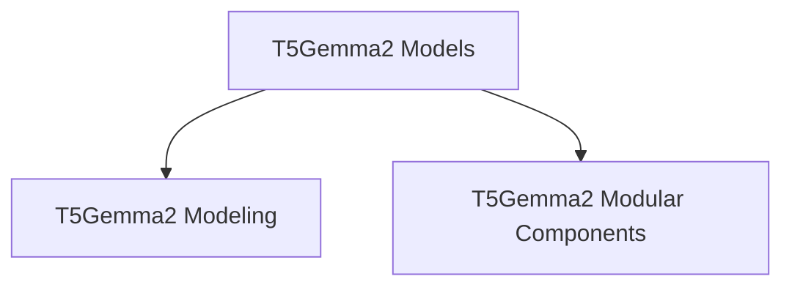

# T5Gemma2 Models Documentation

## Introduction
The `t5gemma2_models` module provides implementations of the T5Gemma2 model for various natural language processing tasks. It includes both standard modeling classes and modular components for conditional generation, sequence classification, and token classification.

## Architecture Overview

The `t5gemma2_models` module is structured into two primary sub-modules:

- [T5Gemma2 Modeling](t5gemma2_modeling.md): Contains the core modeling classes.
- [T5Gemma2 Modular Components](t5gemma2_modular.md): Provides modular implementations of the models.

These sub-modules encapsulate the specific functionalities of the T5Gemma2 model, allowing for clear separation of concerns and easier maintenance.

<!-- DIAGRAM_JSON
{
    "direction": "TD",
    "nodes": [
        {"id": "t5gemma2_modeling", "label": "T5Gemma2 Modeling", "type": "module", "link": "t5gemma2_modeling.md"},
        {"id": "t5gemma2_modular", "label": "T5Gemma2 Modular Components", "type": "module", "link": "t5gemma2_modular.md"}
    ],
    "edges": [
        {"source": "t5gemma2_models", "target": "t5gemma2_modeling"},
        {"source": "t5gemma2_models", "target": "t5gemma2_modular"}
    ],
    "groups": []
}
-->
