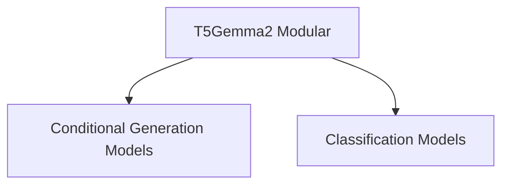

# T5Gemma2 Modular Module

## Introduction

The `t5gemma2_modular` module provides a modular implementation of the T5Gemma2 model for various natural language processing tasks. It extends the base T5Gemma2 architecture with specialized heads for conditional generation, sequence classification, and token classification.

## Architecture Overview

The `t5gemma2_modular` module is structured into sub-modules, each focusing on a specific type of task. The core T5Gemma2 model is utilized across these sub-modules, with different task-specific heads appended. The architecture is designed for flexibility and ease of extension to new tasks.

<!-- DIAGRAM_JSON
{
    "direction": "TD",
    "nodes": [
        {"id": "t5gemma2_modular", "label": "T5Gemma2 Modular", "type": "module"},
        {"id": "conditional_generation_models", "label": "Conditional Generation Models", "type": "module", "link": "conditional_generation_models.md"},
        {"id": "classification_models", "label": "Classification Models", "type": "module", "link": "classification_models.md"}
    ],
    "edges": [
        {"source": "t5gemma2_modular", "target": "conditional_generation_models"},
        {"source": "t5gemma2_modular", "target": "classification_models"}
    ],
    "groups": []
}
-->

## Sub-modules

This module contains the following sub-modules:

### [Conditional Generation Models](conditional_generation_models.md)
This sub-module focuses on tasks such as text summarization, machine translation, and text generation. It includes the `T5Gemma2ForConditionalGeneration` component, which is designed to handle sequence-to-sequence tasks where the output is a generated text sequence conditioned on the input.

### [Classification Models](classification_models.md)
This sub-module provides functionalities for various classification tasks. It includes `T5Gemma2ForSequenceClassification` for classifying entire input sequences and `T5Gemma2ForTokenClassification` for classifying individual tokens within a sequence, such as named entity recognition or part-of-speech tagging.
