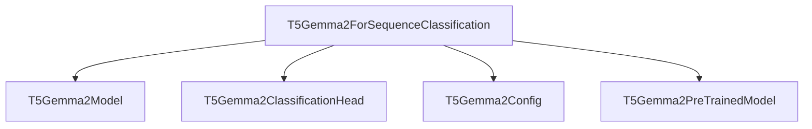

# t5gemma2_sequence_classification

## Introduction

The `t5gemma2_sequence_classification` module provides the capability to perform sequence classification tasks using the T5Gemma2 model architecture. It is a specialized component within the broader [t5gemma2_models](t5gemma2_models.md) family, focusing on adapting the powerful T5Gemma2 model for classification needs.

## Purpose and Core Functionality

The primary purpose of this module is to enable the T5Gemma2 model to handle sequence classification and regression problems. It achieves this by adding a classification head on top of the T5Gemma2 encoder-decoder model. The core functionality is encapsulated within the `T5Gemma2ForSequenceClassification` class, which takes a sequence of input IDs and produces logits for classification or regression based on the provided labels. It supports both single-label and multi-label classification, as well as regression, depending on the `num_labels` specified in the model configuration.

## Architecture and Component Relationships

The `t5gemma2_sequence_classification` module is built upon the foundational [T5Gemma2Model](t5gemma2_models.md). It extends the [T5Gemma2PreTrainedModel](t5gemma2_models.md) and integrates a [T5Gemma2ClassificationHead](t5gemma2_models.md) to process the hidden states generated by the `T5Gemma2Model` into classification scores. The configuration for the model is provided by [T5Gemma2Config](t5gemma2_models.md).

<!-- DIAGRAM_JSON
{
    "direction": "TD",
    "nodes": [
        {"id": "t5gemma2_sequence_classification_component", "label": "T5Gemma2ForSequenceClassification", "type": "component", "link": null},
        {"id": "t5gemma2_model", "label": "T5Gemma2Model", "type": "external", "link": "t5gemma2_models.md"},
        {"id": "t5gemma2_classification_head", "label": "T5Gemma2ClassificationHead", "type": "external", "link": "t5gemma2_models.md"},
        {"id": "t5gemma2_config", "label": "T5Gemma2Config", "type": "external", "link": "t5gemma2_models.md"},
        {"id": "t5gemma2_pretrained_model", "label": "T5Gemma2PreTrainedModel", "type": "external", "link": "t5gemma2_models.md"}
    ],
    "edges": [
        {"source": "t5gemma2_sequence_classification_component", "target": "t5gemma2_model"},
        {"source": "t5gemma2_sequence_classification_component", "target": "t5gemma2_classification_head"},
        {"source": "t5gemma2_sequence_classification_component", "target": "t5gemma2_config"},
        {"source": "t5gemma2_sequence_classification_component", "target": "t5gemma2_pretrained_model"}
    ],
    "groups": []
}
-->


## How the Module Fits into the Overall System

The `t5gemma2_sequence_classification` module serves as a crucial component for downstream tasks requiring classification capabilities on T5Gemma2-processed sequences. It extends the base T5Gemma2 model, allowing it to be fine-tuned and utilized for various text classification benchmarks and real-world applications within the Hugging Face Transformers ecosystem. This module provides a standard and flexible interface for developers to leverage the T5Gemma2 architecture for classification, integrating seamlessly with other components like tokenizers and trainers.

## Component Details

### `T5Gemma2ForSequenceClassification`

`T5Gemma2ForSequenceClassification` is a PyTorch module designed for sequence classification or regression tasks using the T5Gemma2 architecture.

**Class Definition:**

```python
class T5Gemma2ForSequenceClassification(T5Gemma2PreTrainedModel):
    def __init__(self, config: T5Gemma2Config):
        # ... (initialization code) ...

    def get_input_embeddings(self):
        # ...

    def set_input_embeddings(self, value):
        # ...

    def forward(
        self,
        input_ids: torch.LongTensor | None = None,
        pixel_values: torch.FloatTensor | None = None,
        attention_mask: torch.Tensor | None = None,
        position_ids: torch.LongTensor | None = None,
        decoder_input_ids: torch.LongTensor | None = None,
        decoder_attention_mask: torch.Tensor | None = None,
        decoder_position_ids: torch.LongTensor | None = None,
        encoder_outputs: BaseModelOutput | None = None,
        inputs_embeds: torch.FloatTensor | None = None,
        decoder_inputs_embeds: torch.FloatTensor | None = None,
        labels: torch.LongTensor | None = None,
        **kwargs: Unpack[TransformersKwargs],
    ) -> SequenceClassifierOutput:
        # ... (forward pass logic) ...
```

**Constructor (`__init__`)**:

- `config` (`T5Gemma2Config`): The configuration object for the T5Gemma2 model, containing parameters like `num_labels` and `hidden_size`.
    - Initializes the base `T5Gemma2PreTrainedModel`.
    - Sets `num_labels` and `hidden_size` from the configuration.
    - Instantiates the `T5Gemma2Model` (the core encoder-decoder).
    - Initializes `T5Gemma2ClassificationHead` with the `hidden_size`, `num_labels`, and a `classifier_dropout_rate` from the config.

**Methods**:

- `get_input_embeddings()`: Returns the input embeddings layer of the underlying `T5Gemma2Model`.
- `set_input_embeddings(value)`: Sets the input embeddings layer of the underlying `T5Gemma2Model`.
- `forward(...)`: The main forward pass for sequence classification.
    - **Parameters**:
        - `input_ids` (`torch.LongTensor`): Input token IDs.
        - `pixel_values` (`torch.FloatTensor`, *optional*): Pixel values for multimodal inputs (if applicable for T5Gemma2).
        - `attention_mask` (`torch.Tensor`, *optional*): Mask to avoid performing attention on padding token indices.
        - `position_ids` (`torch.LongTensor`, *optional*): Indices of positions for each input sequence token.
        - `decoder_input_ids` (`torch.LongTensor`, *optional*): Decoder input token IDs. If not provided, it's prepared from `input_ids` using `prepare_decoder_input_ids_from_labels`.
        - `decoder_attention_mask` (`torch.Tensor`, *optional*): Mask for decoder attention.
        - `decoder_position_ids` (`torch.LongTensor`, *optional*): Indices of positions for each decoder input sequence token.
        - `encoder_outputs` (`BaseModelOutput`, *optional*): Pre-computed encoder outputs, useful for speeding up decoding.
        - `inputs_embeds` (`torch.FloatTensor`, *optional*): Directly passing embeddings. Currently not supported.
        - `decoder_inputs_embeds` (`torch.FloatTensor`, *optional*): Directly passing decoder embeddings. Currently not supported.
        - `labels` (`torch.LongTensor`, *optional*): Labels for computing the classification/regression loss.
    - **Returns**: `SequenceClassifierOutput`
        - `loss` (`torch.FloatTensor`, *optional*): The computed loss if `labels` are provided.
        - `logits` (`torch.FloatTensor`): The classification logits (pooled from the last non-padding token).
        - `hidden_states` (`tuple(torch.FloatTensor)`, *optional*): Tuple of `torch.FloatTensor` (one for the output of the embeddings + one for the output of each layer) of shape `(batch_size, sequence_length, hidden_size)`.
        - `attentions` (`tuple(torch.FloatTensor)`, *optional*): Tuple of `torch.FloatTensor` (one for each layer) of shape `(batch_size, num_heads, sequence_length, sequence_length)`.
