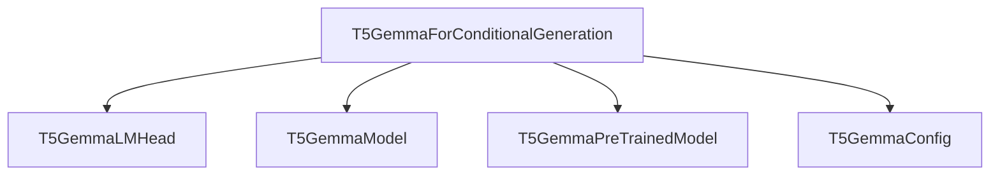

# t5gemma_conditional_generation Module Documentation

## Introduction

The `t5gemma_conditional_generation` module provides the core functionality for conditional text generation using the T5Gemma model architecture. It specifically implements the `T5GemmaForConditionalGeneration` class, which is designed for sequence-to-sequence tasks such as summarization, translation, and question answering, where an input sequence is transformed into an output sequence.

## Architecture and Core Components

The `t5gemma_conditional_generation` module's primary component is `T5GemmaForConditionalGeneration`. This class extends the base T5Gemma model with a language modeling head for generating output sequences conditionally on an input.

### T5GemmaForConditionalGeneration

- **Purpose**: This class is a `T5Gemma` model with a language modeling head on top for sequence-to-sequence conditional generation tasks.
- **Inheritance**: It inherits from [`T5GemmaPreTrainedModel`](t5gemma_models.md) for shared functionalities and configurations, and `GenerationMixin` for common generation methods like `generate()`, `greedy_search()`, etc.
- **Internal Components**:
    - `self.model`: An instance of [`T5GemmaModel`](t5gemma_models.md), which is the core encoder-decoder transformer architecture of T5Gemma.
    - `self.lm_head`: A `T5GemmaLMHead` instance, responsible for projecting the decoder's final hidden states to the vocabulary space to produce logits for token prediction.
- **Forward Method**: The `forward` method processes encoder and decoder inputs, propagates them through the `T5GemmaModel`, and then uses the `lm_head` to compute logits for the next token prediction. If `labels` are provided, it also calculates the masked language modeling loss.

### Relationships and Dependencies

This module relies heavily on the foundational components defined within the broader [`t5gemma_models`](t5gemma_models.md) module, including the base model configuration (`T5GemmaConfig`), the core `T5GemmaModel` architecture, and the `T5GemmaPreTrainedModel` base class.

<!-- DIAGRAM_JSON
{
    "direction": "TD",
    "nodes": [
        {"id": "t5gemma_conditional_generation", "label": "T5GemmaForConditionalGeneration", "type": "component", "link": null},
        {"id": "t5gemma_lm_head", "label": "T5GemmaLMHead", "type": "component", "link": null},
        {"id": "t5gemma_model", "label": "T5GemmaModel", "type": "external", "link": "t5gemma_models.md"},
        {"id": "t5gemma_pretrained_model", "label": "T5GemmaPreTrainedModel", "type": "external", "link": "t5gemma_models.md"},
        {"id": "t5gemma_config", "label": "T5GemmaConfig", "type": "external", "link": "t5gemma_models.md"}
    ],
    "edges": [
        {"source": "t5gemma_conditional_generation", "target": "t5gemma_lm_head"},
        {"source": "t5gemma_conditional_generation", "target": "t5gemma_model"},
        {"source": "t5gemma_conditional_generation", "target": "t5gemma_pretrained_model"},
        {"source": "t5gemma_conditional_generation", "target": "t5gemma_config"}
    ],
    "groups": []
}
-->

## Module Integration

The `t5gemma_conditional_generation` module serves as a specific model head within the larger `t5gemma_models` ecosystem. It is designed to be readily usable for conditional text generation tasks, building upon the shared `T5Gemma` architecture. Developers can instantiate `T5GemmaForConditionalGeneration` to perform tasks like text summarization or machine translation, leveraging its `GenerationMixin` capabilities for various decoding strategies.

Its integration with `T5GemmaModel` ensures that it reuses the established encoder-decoder structure, while `T5GemmaPreTrainedModel` provides utilities for loading, saving, and managing model weights and configurations. This modular design promotes reusability and consistency across different T5Gemma-based tasks.