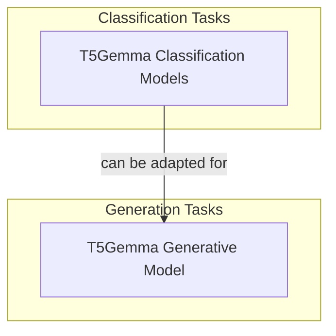

# T5Gemma Models
This module provides various T5Gemma model implementations for different natural language processing tasks, including sequence classification, token classification, and conditional text generation.

<!-- DIAGRAM_JSON
{
    "direction": "TD",
    "nodes": [
        {"id": "t5gemma_classification_models", "label": "T5Gemma Classification Models", "type": "module", "link": "t5gemma_classification_models.md"},
        {"id": "t5gemma_generative_model", "label": "T5Gemma Generative Model", "type": "module", "link": "t5gemma_generative_model.md"}
    ],
    "edges": [
        {"source": "t5gemma_classification_models", "target": "t5gemma_generative_model", "label": "can be adapted for"}
    ],
    "groups": [
        {"id": "classification", "label": "Classification Tasks", "role": "analytical", "nodes": ["t5gemma_classification_models"]},
        {"id": "generation", "label": "Generation Tasks", "role": "generative", "nodes": ["t5gemma_generative_model"]}
    ]
}
-->
