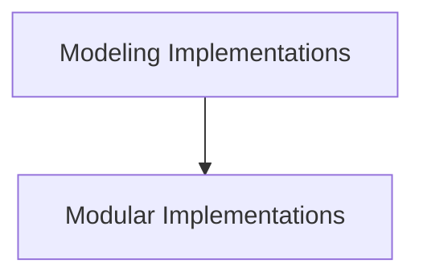

# T5Gemma Models Documentation

This module (`t5gemma_models`) provides various implementations of the T5Gemma model, a powerful encoder-decoder transformer architecture. It includes functionalities for sequence classification, token classification, and conditional generation, offering both standard and modular approaches to integrate the T5Gemma model into diverse NLP tasks.

## Architecture Overview

The `t5gemma_models` module is structured into two primary sub-modules:

1.  **Modeling Implementations**: Contains the direct, core implementations of T5Gemma models for various tasks.
2.  **Modular Implementations**: Offers a more modular approach to T5Gemma model implementations, allowing for flexible component usage.

These sub-modules interact with the base T5Gemma model and its configurations to provide specialized capabilities.

<!-- DIAGRAM_JSON
{
    "direction": "TD",
    "nodes": [
        {"id": "modeling_implementations", "label": "Modeling Implementations", "type": "module", "link": "modeling_implementations.md"},
        {"id": "modular_implementations", "label": "Modular Implementations", "type": "module", "link": "modular_implementations.md"}
    ],
    "edges": [
        {"source": "modeling_implementations", "target": "modular_implementations", "label": "can inform"}
    ],
    "groups": []
}
-->

## Sub-modules

### [Modeling Implementations](modeling_implementations.md)
This sub-module focuses on the direct implementations of T5Gemma for key NLP tasks. It includes:
-   `T5GemmaForSequenceClassification`: For tasks requiring classification of entire input sequences.
-   `T5GemmaForTokenClassification`: For tasks that involve classifying individual tokens within a sequence.
-   `T5GemmaForConditionalGeneration`: Enables the model to perform conditional text generation, such as translation or summarization.

### [Modular Implementations](modular_implementations.md)
This sub-module provides modular variants of the T5Gemma model components, offering greater flexibility and reusability. It includes:
-   `T5GemmaForSequenceClassification`: A modular version for sequence classification.
-   `T5GemmaForTokenClassification`: A modular version for token classification.
-   `T5GemmaForConditionalGeneration`: A modular version for conditional text generation.

These modular components allow developers to more easily swap out or combine different parts of the T5Gemma architecture based on their specific needs.
