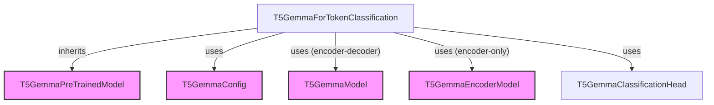

# Module: t5gemma_token_classification

## Introduction
The `t5gemma_token_classification` module provides the necessary components for performing token classification tasks using the T5Gemma model architecture. This module primarily focuses on the `T5GemmaForTokenClassification` model, which extends the base T5Gemma model with a classification head tailored for token-level predictions.

## Core Functionality

### T5GemmaForTokenClassification
`T5GemmaForTokenClassification` is a PyTorch-based model designed for token classification tasks such as Named Entity Recognition (NER), Part-of-Speech (POS) tagging, or any task requiring a label prediction for each token in an input sequence. It supports both encoder-only and encoder-decoder configurations of the T5Gemma architecture.

#### Class: `T5GemmaForTokenClassification`
- **Purpose**: Implements the T5Gemma model for token classification. It adds a classification head on top of the T5Gemma base model's hidden states to predict a label for each token.
- **Inheritance**: Inherits from [`T5GemmaPreTrainedModel`](t5gemma_models.md).
- **Initialization**:
    - `config`: An instance of [`T5GemmaConfig`](t5gemma_models.md) containing the model's configuration.
    - `is_encoder_decoder` (optional): A boolean flag to explicitly specify if an encoder-decoder setup should be used. If `True`, `T5GemmaModel` is used; otherwise, `T5GemmaEncoderModel` is used.
    - Internally, it initializes either a [`T5GemmaModel`](t5gemma_models.md) (for encoder-decoder) or [`T5GemmaEncoderModel`](t5gemma_models.md) (for encoder-only) based on the configuration or the `is_encoder_decoder` flag.
    - A `T5GemmaClassificationHead` is added on top of the base model's output to perform the token-level classification.

- **`forward` Method**:
    - **Inputs**:
        - `input_ids`: Input token IDs for the encoder.
        - `attention_mask`: Attention mask for the encoder.
        - `position_ids`: Positional IDs for the encoder.
        - `decoder_input_ids`: Input token IDs for the decoder (only for encoder-decoder models).
        - `decoder_attention_mask`: Attention mask for the decoder (only for encoder-decoder models).
        - `decoder_position_ids`: Positional IDs for the decoder (only for encoder-decoder models).
        - `encoder_outputs`: Precomputed encoder outputs (optional).
        - `inputs_embeds`: Precomputed input embeddings for the encoder (optional).
        - `decoder_inputs_embeds`: Precomputed input embeddings for the decoder (optional).
        - `labels`: Ground truth labels for computing the loss.
    - **Functionality**:
        - If `is_encoder_decoder` is `True`, it calls the `forward` method of `T5GemmaModel`. If `decoder_input_ids` or `decoder_inputs_embeds` are not provided, it automatically shifts the `input_ids` to the right to create `decoder_input_ids`.
        - If `is_encoder_decoder` is `False`, it calls the `forward` method of `T5GemmaEncoderModel`.
        - It then passes the `last_hidden_state` from the base model's output through the `T5GemmaClassificationHead` to obtain the `logits`.
        - If `labels` are provided, it computes the token classification loss using `self.loss_function`.
    - **Output**: Returns a `TokenClassifierOutput` object containing the computed `loss` (if labels are provided), `logits`, `hidden_states`, and `attentions`.

## Architecture and Component Relationships

The `t5gemma_token_classification` module is built upon the core T5Gemma model components. `T5GemmaForTokenClassification` acts as an extension, integrating a specific head for token-level prediction.

<!-- DIAGRAM_JSON
{
    "direction": "TD",
    "nodes": [
        {"id": "t5gemma_token_classification", "label": "T5GemmaForTokenClassification", "type": "component", "link": null},
        {"id": "t5gemma_model", "label": "T5GemmaModel", "type": "external", "link": "t5gemma_models.md"},
        {"id": "t5gemma_encoder_model", "label": "T5GemmaEncoderModel", "type": "external", "link": "t5gemma_models.md"},
        {"id": "t5gemma_classification_head", "label": "T5GemmaClassificationHead", "type": "component", "link": null},
        {"id": "t5gemma_config", "label": "T5GemmaConfig", "type": "external", "link": "t5gemma_models.md"},
        {"id": "t5gemma_pretrained_model", "label": "T5GemmaPreTrainedModel", "type": "external", "link": "t5gemma_models.md"}
    ],
    "edges": [
        {"source": "t5gemma_token_classification", "target": "t5gemma_pretrained_model", "label": "inherits"},
        {"source": "t5gemma_token_classification", "target": "t5gemma_config", "label": "uses"},
        {"source": "t5gemma_token_classification", "target": "t5gemma_model", "label": "uses (encoder-decoder)"},
        {"source": "t5gemma_token_classification", "target": "t5gemma_encoder_model", "label": "uses (encoder-only)"},
        {"source": "t5gemma_token_classification", "target": "t5gemma_classification_head", "label": "uses"}
    ],
    "groups": []
}
-->

## How the Module Fits into the Overall System
The `t5gemma_token_classification` module is a specialized application of the broader [t5gemma_models](t5gemma_models.md) ecosystem. It provides a concrete implementation for token classification tasks, building directly on the foundational T5Gemma architecture. Developers can leverage this module to fine-tune T5Gemma models for various sequence labeling tasks, integrating seamlessly with other components of the Hugging Face `transformers` library for data processing and training. It offers a ready-to-use solution for token classification without needing to implement the classification head and loss computation from scratch.
