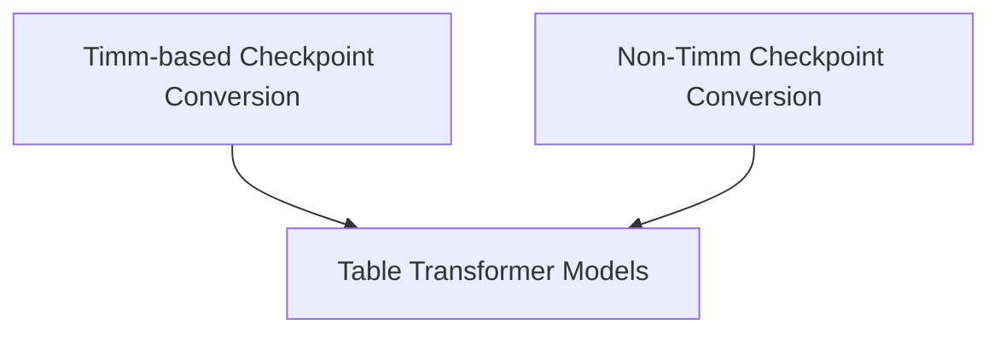

# Table Transformer Models Documentation

The `table_transformer_models` module provides utilities for converting Table Transformer model checkpoints into the Hugging Face format. This module is essential for integrating pre-trained Table Transformer models, originally developed using different frameworks, into the Hugging Face ecosystem for downstream tasks such as object detection and table structure recognition.

## Architecture Overview

The module is structured around two primary conversion utilities, each handling checkpoint conversion with a different approach to backbone integration: one utilizing the `timm` library and another designed to operate without it, using a pre-trained ResNet configuration directly.

### Sub-modules:

*   **[Timm-based Checkpoint Conversion](timm_conversion.md)**: This sub-module focuses on converting Table Transformer checkpoints where the backbone model integration relies on the `timm` library.
*   **[Non-Timm Checkpoint Conversion](no_timm_conversion.md)**: This sub-module provides an alternative conversion path for Table Transformer checkpoints, specifically designed to work without the `timm` library, using a direct ResNet configuration.

<!-- DIAGRAM_JSON
{
    "direction": "TD",
    "nodes": [
        {"id": "timm_conversion", "label": "Timm-based Checkpoint Conversion", "type": "module", "link": "timm_conversion.md"},
        {"id": "no_timm_conversion", "label": "Non-Timm Checkpoint Conversion", "type": "module", "link": "no_timm_conversion.md"}
    ],
    "edges": [
        {"source": "timm_conversion", "target": "table_transformer_models", "label": "converts models"},
        {"source": "no_timm_conversion", "target": "table_transformer_models", "label": "converts models"}
    ],
    "groups": []
}
-->

