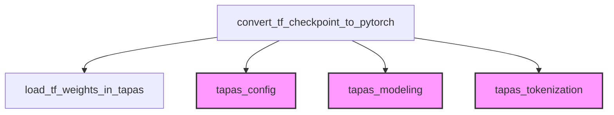

# Tapas Models Documentation

The `tapas_models` module is dedicated to facilitating the conversion of pre-trained TAPAS (TAble PArSing) models from their original TensorFlow checkpoint format to a PyTorch-compatible format. This is crucial for integrating TAPAS models, originally developed in TensorFlow, into PyTorch-based machine learning pipelines and frameworks.

### Purpose and Core Functionality

The primary function of this module, `convert_tf_checkpoint_to_pytorch`, orchestrates the entire conversion process. It handles various TAPAS tasks, including:

*   **SQA (Semantic Question Answering)**: For models designed to answer questions over tables.
*   **WTQ (WikiTableQuestions)**: A dataset for question answering over semi-structured tables.
*   **WIKISQL_SUPERVISED**: For models trained on the WikiSQL dataset for converting natural language questions into SQL queries.
*   **TABFACT**: For models performing fact verification on tabular data.
*   **MLM (Masked Language Modeling)**: For pre-training tasks.
*   **INTERMEDIATE_PRETRAINING**: For general pre-trained TAPAS models.

For each task, the function initializes the appropriate PyTorch model class (`TapasForQuestionAnswering`, `TapasForSequenceClassification`, `TapasForMaskedLM`, `TapasModel`) with a `TapasConfig` loaded from a JSON file. It also sets task-specific hyperparameters within the configuration to match the original TensorFlow model's training setup. After loading the TensorFlow weights into the PyTorch model, it saves the converted model and its associated `TapasTokenizer` to a specified output directory.

### Architecture and Component Relationships

The `tapas_models` module, particularly the `convert_tf_checkpoint_to_pytorch` function, interacts with several key components:

*   **`convert_tf_checkpoint_to_pytorch`**: The central function responsible for parsing configuration, initializing PyTorch models, loading weights, and saving the output.
*   **`load_tf_weights_in_tapas`**: A crucial internal helper function (though its code is not explicitly provided here) that performs the actual mapping and loading of weights from the TensorFlow checkpoint into the PyTorch model.
*   **`TapasConfig`**: Defines the model's architecture and hyperparameters. The conversion process relies heavily on configuring this object based on the task and original TensorFlow configuration.
*   **`TapasForQuestionAnswering`, `TapasForSequenceClassification`, `TapasForMaskedLM`, `TapasModel`**: These are the specific PyTorch model classes instantiated based on the target task. They represent the different head architectures built upon the core TAPAS encoder.
*   **`TapasTokenizer`**: Handles the tokenization of input data, necessary for both the original TensorFlow model and the converted PyTorch model. The tokenizer's vocabulary file is also converted and saved alongside the model.

<!-- DIAGRAM_JSON
{
    "direction": "TD",
    "nodes": [
        {"id": "convert_tf_checkpoint_to_pytorch", "label": "convert_tf_checkpoint_to_pytorch", "type": "component", "link": null},
        {"id": "load_tf_weights_in_tapas", "label": "load_tf_weights_in_tapas", "type": "component", "link": null},
        {"id": "tapas_config", "label": "tapas_config", "type": "external", "link": "tapas_config.md"},
        {"id": "tapas_modeling", "label": "tapas_modeling", "type": "external", "link": "tapas_modeling.md"},
        {"id": "tapas_tokenization", "label": "tapas_tokenization", "type": "external", "link": "tapas_tokenization.md"}
    ],
    "edges": [
        {"source": "convert_tf_checkpoint_to_pytorch", "target": "load_tf_weights_in_tapas"},
        {"source": "convert_tf_checkpoint_to_pytorch", "target": "tapas_config"},
        {"source": "convert_tf_checkpoint_to_pytorch", "target": "tapas_modeling"},
        {"source": "convert_tf_checkpoint_to_pytorch", "target": "tapas_tokenization"}
    ],
    "groups": []
}
-->

### How the Module Fits into the Overall System

The `tapas_models` module serves as a critical bridge for interoperability within a larger machine learning ecosystem. By providing a robust conversion utility, it enables developers to:

*   **Leverage existing TensorFlow checkpoints**: Make use of pre-trained TAPAS models without needing to retrain them in PyTorch.
*   **Integrate into PyTorch workflows**: Seamlessly incorporate converted TAPAS models into PyTorch-based training, evaluation, and inference pipelines.
*   **Facilitate research and development**: Allow researchers and practitioners to easily experiment with TAPAS models across different frameworks, fostering flexibility and collaboration.

This module is a utility component, not directly involved in model training or inference, but rather in the preparation phase of using TAPAS models within a PyTorch environment. It indirectly supports tasks performed by other modules that might rely on TAPAS models for natural language processing on tabular data.