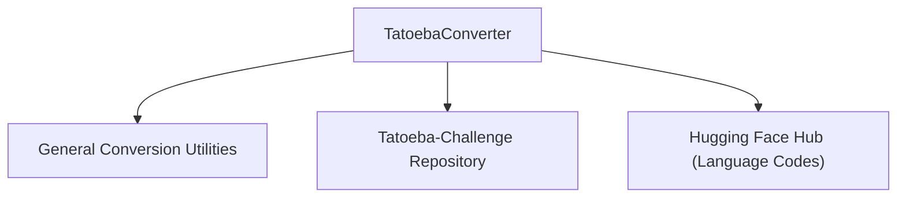

# Tatoeba Conversion Module

The `tatoeba_conversion` module is responsible for converting models from the [Tatoeba-Challenge](https://github.com/Helsinki-NLP/Tatoeba-Challenge) project into the Hugging Face Transformers format. This conversion process involves standardizing language codes, converting model checkpoints, and generating comprehensive model cards with relevant metadata.

## Architecture and Core Components

### TatoebaConverter

The primary component of this module is the `TatoebaConverter` class, which orchestrates the entire conversion workflow. It handles downloading necessary language information, parsing model metadata, converting the actual model weights, and generating structured documentation for the converted models.

#### Core Functionality:

*   **Initialization**: The converter initializes by ensuring the Tatoeba-Challenge repository is available and by downloading language code mappings (alpha3 to alpha2 codes) from external sources. It loads model release results to guide the conversion process.
*   **Model Conversion (`convert_models`)**: This method iterates through specified Tatoeba model IDs. For each model, it performs the following steps:
    1.  **Pre-processing Check**: Verifies if the model uses SentencePiece for pre-processing, skipping models that don't.
    2.  **Download**: Downloads and unzips the original Tatoeba model weights if not already present.
    3.  **Checkpoint Conversion**: Utilizes functionalities (likely from the [general_conversion_utilities](general_conversion_utilities.md) module) to convert the numpy state dicts of the OPUS model into the Hugging Face PyTorch format and renames the model directory to follow Hugging Face conventions (e.g., `opus-mt-aav-eng` to `opus-mt-aav-en`).
    4.  **Model Card Generation**: Calls `write_model_card` to create a `README.md` and `metadata.json` for the converted model.
*   **Model Card Generation (`write_model_card`)**: This method compiles detailed information about the converted model into a `README.md` file and a `metadata.json` file. This includes:
    *   Standardized Hugging Face model ID (e.g., `opus-mt-en-fr`).
    *   Source and target language names and codes (handling multilingual groups).
    *   Links to original OPUS readme and download URLs.
    *   Details on training, validation, and test data.
    *   Performance scores from test sets.
    *   System metadata and specific flags like the presence of backtranslated data or fine-tuning information.
*   **Metadata Parsing (`parse_metadata`)**: This function extracts relevant information from the model's YAML configuration files, such as model type, pre-processing methods, and release dates. It can select the "best" or "newest" model based on specified criteria.
*   **Language Code Resolution (`resolve_lang_code`, `get_tags`, `expand_group_to_two_letter_codes`, `is_group`)**: These helper methods are crucial for converting three-letter ISO language codes to two-letter codes where applicable, and for handling language groups in multilingual models to ensure consistent naming and tagging within the Hugging Face ecosystem.
*   **Language Info Download (`download_lang_info`)**: Ensures that necessary ISO language code mappings (`language-codes-3b2.csv`, `ISO-639-3_20230127.tab`) are available locally for accurate language code conversions.

## Relationship to Other Modules

This `tatoeba_conversion` module is a sub-module of the larger [marian_models](marian_models.md) module, which encompasses various utilities for handling Marian-NMT models within the Hugging Face ecosystem. It specifically relies on functions provided by the [general_conversion_utilities](general_conversion_utilities.md) module for the core logic of converting the underlying model checkpoints from OPUS-MT format to Hugging Face PyTorch format.

<!-- DIAGRAM_JSON
{
    "direction": "TD",
    "nodes": [
        {"id": "tatoeba_converter", "label": "TatoebaConverter", "type": "component", "link": null},
        {"id": "general_conversion_utilities", "label": "General Conversion Utilities", "type": "external", "link": "general_conversion_utilities.md"},
        {"id": "tatoeba_challenge_repo", "label": "Tatoeba-Challenge Repository", "type": "external", "link": "https://github.com/Helsinki-NLP/Tatoeba-Challenge"},
        {"id": "hf_hub_lang_codes", "label": "Hugging Face Hub (Language Codes)", "type": "external", "link": "https://huggingface.co/datasets/huggingface/language_codes_marianMT"}
    ],
    "edges": [
        {"source": "tatoeba_converter", "target": "general_conversion_utilities"},
        {"source": "tatoeba_converter", "target": "tatoeba_challenge_repo"},
        {"source": "tatoeba_converter", "target": "hf_hub_lang_codes"}
    ],
    "groups": []
}
-->

