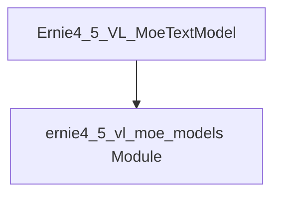

# text_model

## Introduction
The `text_model` module within the `ernie4_5_vl_moe_models` family provides a text modeling component, specifically `Ernie4_5_VL_MoeTextModel`. This particular implementation acts as a deprecated alias or wrapper, directing users to utilize the `Ernie4_5_VLMoeTextModel` directly for the core functionality. Its primary purpose is to maintain backward compatibility while guiding developers towards the updated and preferred text model class for the Ernie 4.5 VL MoE architecture.

## Architecture and Component Relationships

<!-- DIAGRAM_JSON
{
    "direction": "TD",
    "nodes": [
        {"id": "ernie4_5_vl_moe_text_model_component", "label": "Ernie4_5_VL_MoeTextModel", "type": "component", "link": null},
        {"id": "ernie4_5_vl_moe_models", "label": "ernie4_5_vl_moe_models Module", "type": "external", "link": "ernie4_5_vl_moe_models.md"}
    ],
    "edges": [
        {"source": "ernie4_5_vl_moe_text_model_component", "target": "ernie4_5_vl_moe_models"}
    ],
    "groups": []
}
-->

### Core Components

#### Ernie4_5_VL_MoeTextModel
- **Path:** `src.transformers.models.ernie4_5_vl_moe.modeling_ernie4_5_vl_moe.Ernie4_5_VL_MoeTextModel`
- **Purpose:** This class serves as a deprecated entry point for the text model within the Ernie 4.5 VL MoE framework. It inherits from `Ernie4_5_VLMoeTextModel` and issues a warning upon instantiation, advising users to directly use `Ernie4_5_VLMoeTextModel`. This ensures a smooth transition for existing codebases while promoting the use of the latest stable implementation.
- **Key Functionality:**
    - **Deprecation Warning:** Informs users about its deprecated status and suggests the alternative class.
    - **Delegation:** All actual text modeling logic is handled by its base class, `Ernie4_5_VLMoeTextModel`.

## System Integration
The `text_model` module, particularly the `Ernie4_5_VL_MoeTextModel` component, is part of the `ernie4_5_vl_moe_models` module. It plays a role in processing and generating text within the broader Ernie 4.5 VL MoE system. While this specific module is deprecated, its existence highlights the system's commitment to managing changes and providing clear migration paths for developers. The actual core text processing capabilities reside in the `Ernie4_5_VLMoeTextModel` within the parent [ernie4_5_vl_moe_models.md] module.
