# text_model_converters
This module provides utilities for converting various pre-trained model checkpoints from their original formats (e.g., Fairseq, ParlAI, TensorFlow, Orbax, Mamba-SSM) into the Hugging Face Transformers PyTorch format.

<!-- DIAGRAM_JSON
{
  "nodes": [
    {
      "id": "bart_convert_checkpoint",
      "label": "convert_bart_checkpoint"
    },
    {
      "id": "blenderbot_convert_parlai_checkpoint",
      "label": "convert_parlai_checkpoint"
    },
    {
      "id": "electra_convert_tf_checkpoint",
      "label": "convert_tf_checkpoint_to_pytorch"
    },
    {
      "id": "gemma2_main",
      "label": "gemma2.main"
    },
    {
      "id": "gemma2_write_tokenizer",
      "label": "write_tokenizer"
    },
    {
      "id": "gemma2_write_model",
      "label": "write_model"
    },
    {
      "id": "gemma3_main",
      "label": "gemma3.main"
    },
    {
      "id": "gemma3_convert",
      "label": "convert"
    },
    {
      "id": "gemma4_main",
      "label": "gemma4.main"
    },
    {
      "id": "gemma4_convert",
      "label": "convert"
    },
    {
      "id": "gpt2_convert_checkpoint",
      "label": "convert_gpt2_checkpoint_to_pytorch"
    },
    {
      "id": "llama4_write_model",
      "label": "llama4.write_model"
    },
    {
      "id": "m2m100_convert_fairseq_checkpoint",
      "label": "convert_fairseq_m2m100_checkpoint_from_disk"
    },
    {
      "id": "mamba_convert_checkpoint_file",
      "label": "convert_mamba_checkpoint_file_to_huggingface_model_file"
    },
    {
      "id": "mamba_convert_ssm_checkpoint",
      "label": "convert_mamba_ssm_checkpoint_to_huggingface_model"
    },
    {
      "id": "mamba_validate_converted_model",
      "label": "validate_converted_model"
    }
  ],
  "edges": [
    {
      "source": "gemma2_main",
      "target": "gemma2_write_tokenizer"
    },
    {
      "source": "gemma2_main",
      "target": "gemma2_write_model"
    },
    {
      "source": "gemma3_main",
      "target": "gemma3_convert"
    },
    {
      "source": "gemma4_main",
      "target": "gemma4_convert"
    },
    {
      "source": "mamba_convert_checkpoint_file",
      "target": "mamba_convert_ssm_checkpoint"
    },
    {
      "source": "mamba_convert_checkpoint_file",
      "target": "mamba_validate_converted_model"
    }
  ],
  "groups": [
    {
      "id": "BART",
      "label": "BART",
      "nodes": [
        "bart_convert_checkpoint"
      ]
    },
    {
      "id": "Blenderbot",
      "label": "Blenderbot",
      "nodes": [
        "blenderbot_convert_parlai_checkpoint"
      ]
    },
    {
      "id": "Electra",
      "label": "Electra",
      "nodes": [
        "electra_convert_tf_checkpoint"
      ]
    },
    {
      "id": "Gemma2",
      "label": "Gemma2",
      "nodes": [
        "gemma2_main",
        "gemma2_write_tokenizer",
        "gemma2_write_model"
      ]
    },
    {
      "id": "Gemma3",
      "label": "Gemma3",
      "nodes": [
        "gemma3_main",
        "gemma3_convert"
      ]
    },
    {
      "id": "Gemma4",
      "label": "Gemma4",
      "nodes": [
        "gemma4_main",
        "gemma4_convert"
      ]
    },
    {
      "id": "GPT2",
      "label": "GPT2",
      "nodes": [
        "gpt2_convert_checkpoint"
      ]
    },
    {
      "id": "Llama4",
      "label": "Llama4",
      "nodes": [
        "llama4_write_model"
      ]
    },
    {
      "id": "M2M-100",
      "label": "M2M-100",
      "nodes": [
        "m2m100_convert_fairseq_checkpoint"
      ]
    },
    {
      "id": "Mamba",
      "label": "Mamba",
      "nodes": [
        "mamba_convert_checkpoint_file",
        "mamba_convert_ssm_checkpoint",
        "mamba_validate_converted_model"
      ]
    }
  ]
}
-->

```mermaid
flowchart TD
    subgraph BART
        bart_convert_checkpoint["convert_bart_checkpoint"]
    end
    subgraph Blenderbot
        blenderbot_convert_parlai_checkpoint["convert_parlai_checkpoint"]
    end
    subgraph Electra
        electra_convert_tf_checkpoint["convert_tf_checkpoint_to_pytorch"]
    end
    subgraph Gemma2
        gemma2_main["gemma2.main"]
        gemma2_write_tokenizer["write_tokenizer"]
        gemma2_write_model["write_model"]
        gemma2_main --> gemma2_write_tokenizer
        gemma2_main --> gemma2_write_model
    end
    subgraph Gemma3
        gemma3_main["gemma3.main"]
        gemma3_convert["convert"]
        gemma3_main --> gemma3_convert
    end
    subgraph Gemma4
        gemma4_main["gemma4.main"]
        gemma4_convert["convert"]
        gemma4_main --> gemma4_convert
    end
    subgraph GPT2
        gpt2_convert_checkpoint["convert_gpt2_checkpoint_to_pytorch"]
    end
    subgraph Llama4
        llama4_write_model["llama4.write_model"]
    end
    subgraph M2M-100
        m2m100_convert_fairseq_checkpoint["convert_fairseq_m2m100_checkpoint_from_disk"]
    end
    subgraph Mamba
        mamba_convert_checkpoint_file["convert_mamba_checkpoint_file_to_huggingface_model_file"]
        mamba_convert_ssm_checkpoint["convert_mamba_ssm_checkpoint_to_huggingface_model"]
        mamba_validate_converted_model["validate_converted_model"]
        mamba_convert_checkpoint_file --> mamba_convert_ssm_checkpoint
        mamba_convert_checkpoint_file --> mamba_validate_converted_model
    end
```
