# text_modeling Module Documentation

## Introduction

The `text_modeling` module is a core component within the `mllama_models` family, primarily responsible for processing textual inputs and integrating them with visual information in a multimodal large language model context. It implements a sophisticated decoder-only transformer architecture, enabling both self-attention for text comprehension and cross-attention for fusing visual features.

## Comprehensive Documentation

### Purpose and Core Functionality

The `text_modeling` module's main purpose is to serve as the textual backbone for multimodal models, specifically within the `Mllama` architecture. Its central component, `MllamaTextModel`, facilitates the understanding and generation of text by:

*   **Token Embedding**: Converting input text tokens into rich, dense vector representations.
*   **Positional Encoding**: Incorporating positional information into token embeddings to capture sequence order.
*   **Self-Attention**: Processing the text sequence to understand contextual relationships between words.
*   **Cross-Attention**: Integrating visual information by allowing text tokens to attend to processed image features, enabling visually grounded text generation and comprehension.
*   **Efficient Decoding**: Utilizing a key-value cache (`DynamicCache`) for faster and more memory-efficient auto-regressive text generation.

### Architecture and Component Relationships

The `text_modeling` module is built around the `MllamaTextModel`, which interacts with several specialized components and utility functions:

*   **`MllamaTextModel`**: The primary class inheriting from `MllamaPreTrainedModel`. It orchestrates the entire forward pass, managing token embeddings, attention mechanisms (self and cross), and normalization.

*   **`nn.Embedding`**: A standard PyTorch layer used to convert `input_ids` (token indices) into dense `inputs_embeds` (token embeddings).

*   **`MllamaRotaryEmbedding`**: Responsible for applying rotary positional embeddings (RoPE) to the hidden states, providing relative positional information without directly adding position vectors.

*   **Decoder Layers**:
    *   **`MllamaSelfAttentionDecoderLayer`**: These layers are standard transformer decoder blocks that apply self-attention over the textual hidden states, allowing the model to understand the dependencies within the text itself.
    *   **`MllamaCrossAttentionDecoderLayer`**: These specialized layers augment the self-attention mechanism with an additional cross-attention sub-layer. This sub-layer enables the text tokens to attend to `cross_attention_states` (image features) provided by a vision processing module. The selection of self-attention or cross-attention layers is dynamically configured via `config.cross_attention_layers`.

*   **`MllamaTextRMSNorm`**: Applies Root Mean Square Normalization (RMSNorm) to the output hidden states of the decoder stack, stabilizing training and improving performance.

*   **`DynamicCache`**: A utility for managing and retrieving `past_key_values` during sequence generation, significantly speeding up the inference process by avoiding recomputing attention for previous tokens.

*   **`create_causal_mask`**: A helper function used to generate the appropriate causal attention mask, ensuring that tokens can only attend to preceding tokens in the sequence, which is crucial for autoregressive models.

### How the Module Fits into the Overall System

The `text_modeling` module is an integral part of the larger `mllama_models` multimodal architecture. It acts as the central hub for textual understanding and multimodal fusion. It receives raw text inputs, processes them, and critically, integrates visual features (e.g., image embeddings, bounding box information) provided by an associated image processing module (see [image_processing.md](image_processing.md)).

This integration is facilitated through the `cross_attention_states` and `cross_attention_mask` parameters passed to the `MllamaTextModel`. This design allows the overall `Mllama` model to generate text that is contextually relevant to both the provided text prompt and any accompanying images, making it highly effective for tasks such as image captioning, visual question answering, and multimodal dialogue systems.

It depends on foundational components defined within the broader `mllama_models` framework, such as [MllamaPreTrainedModel](mllama_models.md) and [MllamaTextConfig](mllama_models.md), for its basic structure and configuration.

<!-- DIAGRAM_JSON
{
    "direction": "TD",
    "nodes": [
        {"id": "mllama_text_model", "label": "MllamaTextModel", "type": "component", "link": null},
        {"id": "mllama_pretrained_model", "label": "MllamaPreTrainedModel", "type": "external", "link": "mllama_models.md"},
        {"id": "mllama_text_config", "label": "MllamaTextConfig", "type": "external", "link": "mllama_models.md"},
        {"id": "mllama_cross_attention_decoder_layer", "label": "MllamaCrossAttentionDecoderLayer", "type": "component", "link": null},
        {"id": "mllama_self_attention_decoder_layer", "label": "MllamaSelfAttentionDecoderLayer", "type": "component", "link": null},
        {"id": "mllama_text_rms_norm", "label": "MllamaTextRMSNorm", "type": "component", "link": null},
        {"id": "mllama_rotary_embedding", "label": "MllamaRotaryEmbedding", "type": "component", "link": null},
        {"id": "image_processing", "label": "Image Processing Module", "type": "external", "link": "image_processing.md"},
        {"id": "dynamic_cache", "label": "DynamicCache", "type": "external", "link": null},
        {"id": "create_causal_mask", "label": "create_causal_mask", "type": "external", "link": null}
    ],
    "edges": [
        {"source": "mllama_text_model", "target": "mllama_pretrained_model"},
        {"source": "mllama_text_model", "target": "mllama_text_config"},
        {"source": "mllama_text_model", "target": "mllama_cross_attention_decoder_layer"},
        {"source": "mllama_text_model", "target": "mllama_self_attention_decoder_layer"},
        {"source": "mllama_text_model", "target": "mllama_text_rms_norm"},
        {"source": "mllama_text_model", "target": "mllama_rotary_embedding"},
        {"source": "mllama_text_model", "target": "image_processing"},
        {"source": "mllama_text_model", "target": "dynamic_cache"},
        {"source": "mllama_text_model", "target": "create_causal_mask"}
    ],
    "groups": []
}
-->

```mermaid
graph TD
    mllama_text_model[MllamaTextModel]
    mllama_pretrained_model[MllamaPreTrainedModel]
    mllama_text_config[MllamaTextConfig]
    mllama_cross_attention_decoder_layer[MllamaCrossAttentionDecoderLayer]
    mllama_self_attention_decoder_layer[MllamaSelfAttentionDecoderLayer]
    mllama_text_rms_norm[MllamaTextRMSNorm]
    mllama_rotary_embedding[MllamaRotaryEmbedding]
    image_processing[Image Processing Module]
    dynamic_cache[DynamicCache]
    create_causal_mask[create_causal_mask]

    mllama_text_model --> mllama_pretrained_model
    mllama_text_model --> mllama_text_config
    mllama_text_model --> mllama_cross_attention_decoder_layer
    mllama_text_model --> mllama_self_attention_decoder_layer
    mllama_text_model --> mllama_text_rms_norm
    mllama_text_model --> mllama_rotary_embedding
    mllama_text_model --> image_processing
    mllama_text_model --> dynamic_cache
    mllama_text_model --> create_causal_mask
```

