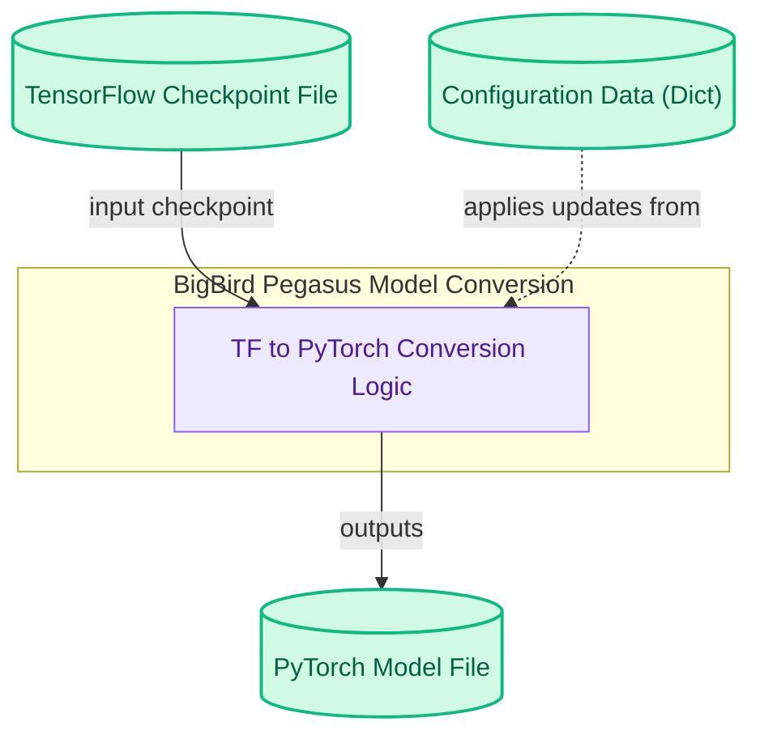

# TF Model Conversion
This module provides functionality to convert BigBird Pegasus models from TensorFlow checkpoint format to a PyTorch model, facilitating seamless integration and utilization within PyTorch ecosystems.

<!-- DIAGRAM_JSON
{
    "direction": "TD",
    "nodes": [
        {
            "id": "tf_ckpt",
            "label": "TensorFlow Checkpoint File",
            "type": "data",
            "link": null
        },
        {
            "id": "conversion_logic",
            "label": "TF to PyTorch Conversion Logic",
            "type": "component",
            "link": null
        },
        {
            "id": "config_data",
            "label": "Configuration Data (Dict)",
            "type": "data",
            "link": null
        },
        {
            "id": "pytorch_model",
            "label": "PyTorch Model File",
            "type": "data",
            "link": null
        }
    ],
    "edges": [
        {
            "source": "tf_ckpt",
            "target": "conversion_logic",
            "label": "input checkpoint"
        },
        {
            "source": "config_data",
            "target": "conversion_logic",
            "label": "applies updates from"
        },
        {
            "source": "conversion_logic",
            "target": "pytorch_model",
            "label": "outputs"
        }
    ],
    "groups": [
        {
            "id": "model_conversion_group",
            "label": "BigBird Pegasus Model Conversion",
            "role": "analytical",
            "nodes": [
                "conversion_logic"
            ]
        }
    ]
}
-->
