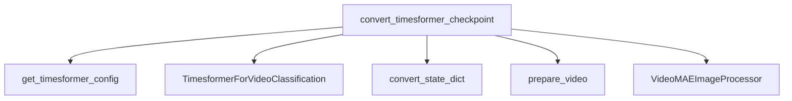

# Timesformer Models Documentation

## Introduction

This document provides comprehensive documentation for the `timesformer_models` module. This module is primarily responsible for converting pre-trained Timesformer model checkpoints, originally implemented in other frameworks, into a PyTorch-compatible format. It also includes mechanisms for verifying the converted models and facilitating their integration into the Hugging Face ecosystem.

## Purpose and Core Functionality

The `timesformer_models` module centralizes the logic for adapting Timesformer models for use within the PyTorch and Hugging Face Transformers framework. Its core functionality revolves around the `convert_timesformer_checkpoint` utility, which performs the following key operations:

1.  **Configuration Loading**: Retrieves the appropriate configuration for the specified Timesformer model variant.
2.  **Model Initialization**: Instantiates a `TimesformerForVideoClassification` model based on the loaded configuration.
3.  **Checkpoint Conversion**: Downloads and converts the original Timesformer checkpoint's state dictionary to match the PyTorch model's architecture.
4.  **Model Verification**: Runs the converted model on a sample video input and asserts that the output logits match expected values for various pre-trained models (e.g., Kinetics-400, Kinetics-600, Something-Something-v2).
5.  **Model Saving**: Saves the converted PyTorch model and its associated image processor to a specified local directory.
6.  **Hub Integration**: Optionally pushes the converted model to the Hugging Face Hub, making it available for public or private use.

This module ensures seamless migration of Timesformer models, enabling their leverage within the broader Transformers ecosystem for video classification and related tasks.

## Architecture and Component Relationships

The `timesformer_models` module currently contains a single core component, `convert_timesformer_checkpoint`, which orchestrates the entire conversion and verification process. It interacts with several internal helper functions and external modules to achieve its functionality.

<!-- DIAGRAM_JSON
{
    "direction": "TD",
    "nodes": [
        {"id": "convert_timesformer_checkpoint", "label": "convert_timesformer_checkpoint", "type": "component", "link": null},
        {"id": "get_timesformer_config", "label": "get_timesformer_config", "type": "component", "link": null},
        {"id": "timesformer_for_video_classification", "label": "TimesformerForVideoClassification", "type": "component", "link": null},
        {"id": "convert_state_dict", "label": "convert_state_dict", "type": "component", "link": null},
        {"id": "prepare_video", "label": "prepare_video", "type": "component", "link": null},
        {"id": "videomae_image_processor", "label": "VideoMAEImageProcessor", "type": "external", "link": "videomae_models.md"}
    ],
    "edges": [
        {"source": "convert_timesformer_checkpoint", "target": "get_timesformer_config"},
        {"source": "convert_timesformer_checkpoint", "target": "timesformer_for_video_classification"},
        {"source": "convert_timesformer_checkpoint", "target": "convert_state_dict"},
        {"source": "convert_timesformer_checkpoint", "target": "prepare_video"},
        {"source": "convert_timesformer_checkpoint", "target": "videomae_image_processor"}
    ],
    "groups": []
}
-->

### Component Details

*   `convert_timesformer_checkpoint`: The main function responsible for the conversion and verification workflow. It takes the checkpoint URL, output path, model name, and a flag for pushing to the hub as inputs.
*   `get_timesformer_config`: A helper function (assumed to be internal to the Timesformer implementation) that retrieves the model configuration based on the provided `model_name`.
*   `TimesformerForVideoClassification`: The PyTorch model class for Timesformer video classification, which is instantiated and loaded with the converted weights.
*   `convert_state_dict`: A utility function that maps the keys and values from the original checkpoint's state dictionary to the PyTorch model's state dictionary format.
*   `prepare_video`: A utility function that generates a sample video input for model verification.

### External Dependencies

*   `videomae_image_processor`: The `VideoMAEImageProcessor` is used for preparing video inputs for the Timesformer model. It is likely part of the broader image/video processing utilities within the `transformers` library. For more details, refer to the [videomae_models documentation](videomae_models.md).

## How the Module Fits into the Overall System

The `timesformer_models` module plays a crucial role in expanding the range of readily available pre-trained models within the Hugging Face Transformers ecosystem. By providing a robust conversion and verification mechanism, it enables researchers and developers to easily leverage existing Timesformer checkpoints, which are often trained in different environments or frameworks, directly within PyTorch. This integration facilitates benchmarking, fine-tuning, and deployment of Timesformer models for various video understanding tasks, without the need for manual weight adaptation.

This module serves as a bridge, ensuring interoperability and ease of use for Timesformer models, making them accessible to a wider community of machine learning practitioners. It aligns with the overall goal of the `transformers` library to provide a unified interface for a vast collection of state-of-the-art models.