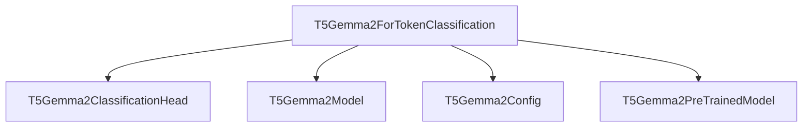

# Module: `token_classification`

## Introduction

The `token_classification` module provides the `T5Gemma2ForTokenClassification` class, a specialized model built upon the T5Gemma2 architecture for performing token-level classification tasks. This module is designed for scenarios where each token in an input sequence needs to be classified into one of several predefined categories, such as Named Entity Recognition (NER) or Part-of-Speech (POS) tagging.

## Architecture and Component Relationships

The `token_classification` module primarily consists of the `T5Gemma2ForTokenClassification` class, which integrates with other core T5Gemma2 components to deliver its functionality.

<!-- DIAGRAM_JSON
{
    "direction": "TD",
    "nodes": [
        {"id": "t5gemma2_for_token_classification", "label": "T5Gemma2ForTokenClassification", "type": "component", "link": null},
        {"id": "t5gemma2_classification_head", "label": "T5Gemma2ClassificationHead", "type": "external", "link": "t5gemma2_modeling.md"},
        {"id": "t5gemma2_model", "label": "T5Gemma2Model", "type": "external", "link": "t5gemma2_modeling.md"},
        {"id": "t5gemma2_config", "label": "T5Gemma2Config", "type": "external", "link": "t5gemma2_models.md"},
        {"id": "t5gemma2_pretrained_model", "label": "T5Gemma2PreTrainedModel", "type": "external", "link": "t5gemma2_modeling.md"}
    ],
    "edges": [
        {"source": "t5gemma2_for_token_classification", "target": "t5gemma2_classification_head", "label": "uses"},
        {"source": "t5gemma2_for_token_classification", "target": "t5gemma2_model", "label": "wraps"},
        {"source": "t5gemma2_for_token_classification", "target": "t5gemma2_config", "label": "configures with"},
        {"source": "t5gemma2_for_token_classification", "target": "t5gemma2_pretrained_model", "label": "inherits from"}
    ],
    "groups": []
}
-->

### Components

*   **`T5Gemma2ForTokenClassification`**: This is the primary class of the module. It extends `T5Gemma2PreTrainedModel` and encapsulates the logic for performing token classification. It initializes a base `T5Gemma2Model` and a `T5Gemma2ClassificationHead` for the final prediction layer. The `forward` method orchestrates the model's execution, passing inputs through the T5Gemma2 encoder-decoder stack and then through the classification head to produce token-level logits.

### External Dependencies

*   **`T5Gemma2Model`**: The core T5Gemma2 encoder-decoder model, responsible for processing input sequences and generating hidden states. This is provided by the [t5gemma2_modeling module](t5gemma2_modeling.md).
*   **`T5Gemma2ClassificationHead`**: (Refer to [t5gemma2_modeling.md](t5gemma2_modeling.md)) A simple classification head typically consisting of a dropout layer and a linear layer. It takes the `last_hidden_state` from the T5Gemma2 decoder and projects it to the dimension of `num_labels`, providing the raw scores (logits) for each token.

*   **`T5Gemma2Config`**: The configuration class that defines the hyperparameters and architectural details of the T5Gemma2 model and its specific heads. This is part of the broader [t5gemma2_models module](t5gemma2_models.md).
*   **`T5Gemma2PreTrainedModel`**: The base class for all T5Gemma2 models, providing common functionalities like weight initialization, loading pre-trained weights, and handling configurations. It is also found within the [t5gemma2_modeling module](t5gemma2_modeling.md).

## System Integration

The `token_classification` module is a specialized application of the T5Gemma2 model within the `t5gemma2_models` ecosystem. It leverages the robust sequence-to-sequence capabilities of the base `T5Gemma2Model` and customizes it with a classification head for token-level predictions.

It fits into the overall system as a task-specific model, enabling users to fine-tune T5Gemma2 for tasks like named entity recognition, part-of-speech tagging, or any other sequence labeling problem. Developers can utilize this module by providing tokenized input sequences and labels, and the model will output logits for each token, which can then be used to compute a classification loss. Its design ensures modularity, allowing for easy integration into existing training and evaluation pipelines that handle token classification tasks.
