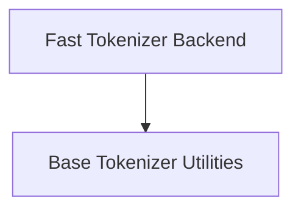

# Tokenization Utilities Module

## Introduction

The `tokenization_utilities` module provides core functionalities for tokenization within the Transformers library. It defines the base interface for all tokenizers and offers a fast backend implementation leveraging the HuggingFace `tokenizers` library. This module is essential for converting text into numerical representations (tokens) that can be processed by various models, and for converting token IDs back into human-readable text.

## Architecture Overview

The module's architecture is centered around a base class that establishes common tokenizer behaviors, and a specialized backend that implements these behaviors efficiently using the `tokenizers` Rust library.

<!-- DIAGRAM_JSON
{
    "direction": "TD",
    "nodes": [
        {"id": "tokenizer_base", "label": "Base Tokenizer Utilities", "type": "module", "link": "tokenizer_base.md"},
        {"id": "tokenizers_backend", "label": "Fast Tokenizer Backend", "type": "module", "link": "tokenizers_backend.md"}
    ],
    "edges": [
        {"source": "tokenizers_backend", "target": "tokenizer_base", "label": "inherits from"}
    ],
    "groups": []
}
-->

## Sub-modules

Here are the key sub-modules within `tokenization_utilities`:

### [Base Tokenizer Utilities](tokenizer_base.md)

This sub-module provides the `PreTrainedTokenizerBase` class, which serves as the fundamental abstraction for all tokenizers. It defines common attributes and methods for managing vocabulary, special tokens, padding, truncation, and the overall encoding/decoding workflow. All concrete tokenizer implementations inherit from this base class to ensure consistent behavior.

### [Fast Tokenizer Backend](tokenizers_backend.md)

The `tokenizers_backend` sub-module introduces the `TokenizersBackend` class. This class extends `PreTrainedTokenizerBase` and provides a highly optimized implementation of tokenization by wrapping the `tokenizers` Rust library. It offers significant performance improvements for common tokenization tasks and handles the intricacies of integrating with the Rust-based tokenizers while maintaining compatibility with the base tokenizer interface.
