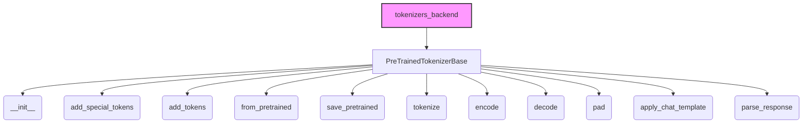

# Tokenizer Base Module

The `tokenizer_base` module provides the foundational `PreTrainedTokenizerBase` class, which serves as the base for all tokenizer implementations within the Hugging Face Transformers library. This module establishes a consistent interface and handles core functionalities such as managing special tokens, encoding and decoding text, applying padding and truncation strategies, and facilitating chat template application and response parsing.

### Purpose and Core Functionality

The primary purpose of `tokenizer_base` is to define the essential contract and common utilities required by all tokenizers, regardless of their specific tokenization algorithm (e.g., WordPiece, SentencePiece, BPE). It centralizes functionalities that are crucial for preparing text data for various models, ensuring interoperability and ease of use across different model architectures.

Key functionalities provided by `PreTrainedTokenizerBase` include:

*   **Special Token Management**: Defines and manages special tokens like `bos_token`, `eos_token`, `unk_token`, `pad_token`, `cls_token`, `mask_token`, and `extra_special_tokens`. It provides methods to add, retrieve, and map these tokens to their respective IDs.
*   **Text Encoding**: Converts raw text or pre-tokenized sequences into input IDs and other model-specific inputs (e.g., attention masks, token type IDs) suitable for consumption by a model.
*   **Text Decoding**: Reconstructs readable text from a sequence of token IDs, with options to skip special tokens and clean up tokenization artifacts.
*   **Padding and Truncation**: Implements flexible strategies for padding sequences to a uniform length and truncating sequences that exceed a specified maximum length, which are critical for batch processing.
*   **Serialization and Deserialization**: Enables saving and loading tokenizer configurations and vocabulary files from local directories or the Hugging Face Hub, supporting `from_pretrained` and `save_pretrained` methods.
*   **Chat Template Application**: Provides robust mechanisms for formatting conversational inputs according to predefined Jinja-based chat templates, including support for tool use and RAG documents.
*   **Response Parsing**: Offers utility to parse model-generated output strings into structured message dictionaries based on a defined schema.

### Architecture and Component Relationships

The `tokenizer_base` module's architecture is centered around the `PreTrainedTokenizerBase` class. This class is designed to be abstract in certain aspects, requiring concrete tokenizer implementations to override specific methods (e.g., `_add_tokens`, `convert_ids_to_tokens`, `tokenize`, `_encode_plus`, `_decode`, `save_vocabulary`) to handle their particular tokenization logic.

<!-- DIAGRAM_JSON
{
    "direction": "TD",
    "nodes": [
        {"id": "PreTrainedTokenizerBase", "label": "PreTrainedTokenizerBase", "type": "component", "link": null},
        {"id": "init_method", "label": "__init__", "type": "component", "link": null},
        {"id": "add_special_tokens_method", "label": "add_special_tokens", "type": "component", "link": null},
        {"id": "add_tokens_method", "label": "add_tokens", "type": "component", "link": null},
        {"id": "from_pretrained_method", "label": "from_pretrained", "type": "component", "link": null},
        {"id": "save_pretrained_method", "label": "save_pretrained", "type": "component", "link": null},
        {"id": "tokenize_method", "label": "tokenize", "type": "component", "link": null},
        {"id": "encode_method", "label": "encode", "type": "component", "link": null},
        {"id": "decode_method", "label": "decode", "type": "component", "link": null},
        {"id": "pad_method", "label": "pad", "type": "component", "link": null},
        {"id": "apply_chat_template_method", "label": "apply_chat_template", "type": "component", "link": null},
        {"id": "parse_response_method", "label": "parse_response", "type": "component", "link": null},
        {"id": "tokenizers_backend", "label": "tokenizers_backend", "type": "external", "link": "tokenizers_backend.md"}
    ],
    "edges": [
        {"source": "PreTrainedTokenizerBase", "target": "init_method"},
        {"source": "PreTrainedTokenizerBase", "target": "add_special_tokens_method"},
        {"source": "PreTrainedTokenizerBase", "target": "add_tokens_method"},
        {"source": "PreTrainedTokenizerBase", "target": "from_pretrained_method"},
        {"source": "PreTrainedTokenizerBase", "target": "save_pretrained_method"},
        {"source": "PreTrainedTokenizerBase", "target": "tokenize_method"},
        {"source": "PreTrainedTokenizerBase", "target": "encode_method"},
        {"source": "PreTrainedTokenizerBase", "target": "decode_method"},
        {"source": "PreTrainedTokenizerBase", "target": "pad_method"},
        {"source": "PreTrainedTokenizerBase", "target": "apply_chat_template_method"},
        {"source": "PreTrainedTokenizerBase", "target": "parse_response_method"},
        {"source": "tokenizers_backend", "target": "PreTrainedTokenizerBase"}
    ],
    "groups": []
}
-->

### System Integration

The `tokenizer_base` module, through its `PreTrainedTokenizerBase` class, is a cornerstone of the `tokenization_utilities` system. It provides the abstract interface and common functionalities that all other tokenizer modules inherit from or interact with.

*   **Foundation for Specific Tokenizers**: Nearly all concrete tokenizer classes in the Transformers library (e.g., `BertTokenizer`, `GPT2Tokenizer`, `T5Tokenizer`) inherit directly or indirectly from `PreTrainedTokenizerBase`. This ensures a consistent API and shared core logic across the diverse range of tokenizers.
*   **Interaction with `tokenizers_backend`**: The `tokenizers_backend` module, which contains `TokenizersBackend`, typically represents tokenizers built using the Rust-based `tokenizers` library for speed and efficiency. `TokenizersBackend` itself inherits from `PreTrainedTokenizerBase`, leveraging its foundational methods while providing optimized backend-specific implementations. For more details, refer to the [tokenizers_backend documentation](tokenizers_backend.md).
*   **Integration with Models**: The outputs of `PreTrainedTokenizerBase` (e.g., `input_ids`, `attention_mask`) are designed to directly feed into various `PreTrainedModel` instances for tasks like text classification, question answering, and sequence generation.
*   **Hub Integration**: By inheriting from `PushToHubMixin`, `PreTrainedTokenizerBase` facilitates seamless interaction with the Hugging Face Hub, allowing users to easily share and load tokenizers.

This modular design ensures that new tokenizers can be easily integrated into the library by extending `PreTrainedTokenizerBase` and implementing the necessary abstract methods, while benefiting from the robust common functionalities already provided.
