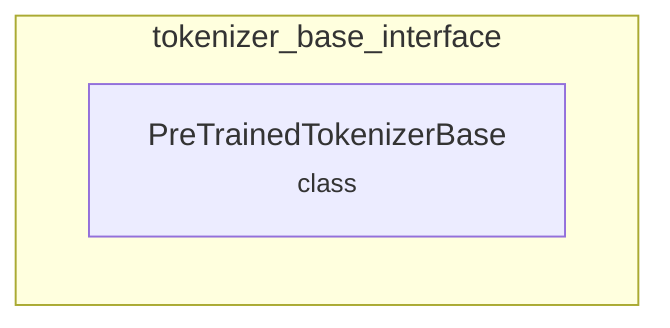

# tokenizer_base_interface
Defines the `PreTrainedTokenizerBase` class, serving as the foundational interface for all tokenizer backends in the Hugging Face Transformers library.

<!-- DIAGRAM_JSON
{
  "nodes": [
    {"id": "C_PreTrainedTokenizerBase", "label": "PreTrainedTokenizerBase", "type": "class"}
  ],
  "edges": [],
  "groups": [
    {"id": "G_tokenizer_base_interface", "label": "tokenizer_base_interface", "type": "module", "contains": ["C_PreTrainedTokenizerBase"]}
  ]
}
-->
