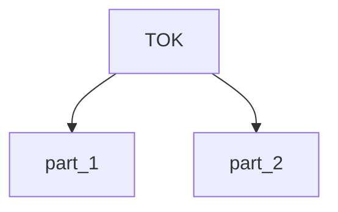

# Tokenizers

This module contains 2 sub-modules:

- [part_1](part_1.md) - 1 components
- [part_2](part_2.md) - 2 components

## Architecture

```mermaid
graph TD
    TOK --> A[part_1]
    TOK --> B[part_2]
```
