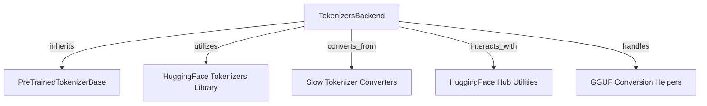

# `tokenizers_backend` Module Documentation

## Introduction

The `tokenizers_backend` module is a crucial component within the `transformers` library, specifically designed to provide a high-performance backend for tokenization operations. It leverages the Hugging Face `tokenizers` library (written in Rust) to offer fast and efficient text processing capabilities. This module defines the `TokenizersBackend` class, which serves as the base for all fast tokenizers, handling common functionalities such as vocabulary management, special token handling, serialization, and training.

## Core Functionality

### `TokenizersBackend` Class

The `src.transformers.tokenization_utils_tokenizers.TokenizersBackend` class is the cornerstone of this module. It inherits from [`PreTrainedTokenizerBase`](tokenizer_base.md) and provides a unified interface for interacting with various fast tokenizer models (BPE, Unigram, WordPiece, WordLevel). Its key responsibilities include:

*   **Initialization and Setup**: The `__init__` method orchestrates the creation of the underlying Rust `tokenizers.Tokenizer` object, either from a `tokenizer.json` file, a pre-existing `tokenizer_object`, or by converting a slow tokenizer format (like SentencePiece models or GGUF files). It also configures truncation and padding settings.
*   **Vocabulary and Token Management**: It manages the tokenizer's vocabulary, including base vocabulary and any added tokens. Methods like `vocab_size`, `get_vocab`, `added_tokens_encoder`, and `added_tokens_decoder` provide access to this information. It also supports adding new tokens via `_add_tokens`.
*   **Encoding and Decoding**: Provides core methods for converting text into token IDs (`_encode_plus`, `tokenize`) and token IDs back into text (`_decode`, `convert_tokens_to_string`). It handles various encoding parameters such as `add_special_tokens`, `padding_strategy`, `truncation_strategy`, and `return_overflowing_tokens`.
*   **Serialization and Deserialization**: Facilitates saving the tokenizer's vocabulary and configuration (`save_vocabulary`, `_save_pretrained`) and loading them.
*   **Special Token Handling**: Manages the addition and recognition of special tokens (e.g., `bos_token`, `eos_token`, `pad_token`) and updates the internal post-processor accordingly (`update_post_processor`).
*   **Training**: Offers a `train_new_from_iterator` method to train a new fast tokenizer from a given text corpus, using the same configuration as the current instance.
*   **Mistral Regex Patching**: Includes a mechanism (`_patch_mistral_regex`) to correct known incorrect regex patterns in Mistral-related tokenizers, ensuring accurate tokenization.
*   **GGUF Conversion**: Supports loading and converting GGUF tokenizer formats.

## Architecture and Component Relationships

The `tokenizers_backend` module, centered around the `TokenizersBackend` class, interacts with several other components and external libraries to provide its functionality.

<!-- DIAGRAM_JSON
{
    "direction": "TD",
    "nodes": [
        {"id": "tokenizers_backend", "label": "TokenizersBackend", "type": "component", "link": null},
        {"id": "pretrained_tokenizer_base", "label": "PreTrainedTokenizerBase", "type": "external", "link": "tokenizer_base.md"},
        {"id": "hf_tokenizers_library", "label": "HuggingFace Tokenizers Library", "type": "external", "link": null},
        {"id": "slow_tokenizer_converters", "label": "Slow Tokenizer Converters", "type": "external", "link": null},
        {"id": "huggingface_hub_utils", "label": "HuggingFace Hub Utilities", "type": "external", "link": null},
        {"id": "gguf_conversion_helpers", "label": "GGUF Conversion Helpers", "type": "external", "link": null}
    ],
    "edges": [
        {"source": "tokenizers_backend", "target": "pretrained_tokenizer_base"},
        {"source": "tokenizers_backend", "target": "hf_tokenizers_library"},
        {"source": "tokenizers_backend", "target": "slow_tokenizer_converters"},
        {"source": "tokenizers_backend", "target": "huggingface_hub_utils"},
        {"source": "tokenizers_backend", "target": "gguf_conversion_helpers"}
    ],
    "groups": []
}
-->

### Relationships Explained

*   **`PreTrainedTokenizerBase` (Parent)**: `TokenizersBackend` inherits from [`PreTrainedTokenizerBase`](tokenizer_base.md), providing a common interface and shared attributes for all tokenizers within the `transformers` ecosystem, whether they are "slow" (Python-based) or "fast" (Rust-based).
*   **Hugging Face `tokenizers` Library**: This is the primary dependency. `TokenizersBackend` directly utilizes classes from the `tokenizers` library, such as `TokenizerFast` for the core tokenization logic, `BPE` and `Unigram` for model implementations, `processors.TemplateProcessing` for post-processing steps (e.g., adding BOS/EOS tokens), and `pre_tokenizers` for text segmentation.
*   **Slow Tokenizer Converters**: The `convert_to_native_format` method relies on various converters (e.g., `SentencePieceExtractor`, `TikTokenConverter`, `MistralConverter`, `SpmConverter` from `transformers.convert_slow_tokenizer`) to transform tokenizer models from other formats (like `.model` files or `tekken.json`) into the `tokenizers` library's native format.
*   **HuggingFace Hub Utilities**: For remote model loading and configuration patching, the module interacts with `huggingface_hub.model_info` and `transformers.utils.hub.cached_file` to fetch model information and cached files.
*   **GGUF Conversion Helpers**: The module includes specific logic (`load_gguf_checkpoint`, `convert_gguf_tokenizer`) to handle the conversion and loading of GGUF (GGML Unified Format) tokenizer files, ensuring compatibility with quantized models.

## How the Module Fits into the Overall System

The `tokenizers_backend` module is integral to the `transformers` library's performance and versatility. It acts as the high-speed engine for text preparation, enabling:

*   **Efficient Preprocessing**: By providing a Rust-based backend, it significantly accelerates tokenization, which is often a bottleneck in large-scale NLP tasks and real-time applications.
*   **Unified Tokenization Interface**: Despite leveraging a different underlying implementation, it maintains consistency with the `PreTrainedTokenizerBase` interface, allowing developers to switch between slow and fast tokenizers seamlessly without changing their code.
*   **Broad Model Support**: Its robust conversion mechanisms (from SentencePiece, GGUF, etc.) ensure that a wide array of pre-trained models, regardless of their original tokenizer format, can benefit from the speed of the `tokenizers` library.
*   **Specialized Handling**: Features like the Mistral regex patch demonstrate its role in addressing specific model-related quirks to ensure correct and reliable tokenization across the ecosystem.

In essence, `tokenizers_backend` empowers the `transformers` library to deliver both flexibility in tokenizer choice and optimal performance for diverse NLP workflows.
