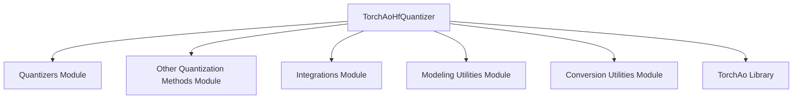

# TorchAo Quantizer Module Documentation

## Introduction

The `torchao_quantizer` module provides the `TorchAoHfQuantizer` class, which is a specialized quantizer for integrating `torchao` (PyTorch Ahead-of-Time Optimization) quantization techniques into Hugging Face Transformers models. This module enables the quantization of model weights, primarily for `nn.Linear` and optionally `nn.Embedding` layers, to optimize models for deployment and inference.

## Architecture and Component Relationships

The `TorchAoHfQuantizer` acts as an interface between the generic `HfQuantizer` framework and the `torchao` library. It handles environment validation, manages state dictionary flattening for safetensors compatibility, adjusts memory requirements for quantized parameters, and orchestrates the application of torchao-specific quantization and deserialization operations.

<!-- DIAGRAM_JSON
{
    "direction": "TD",
    "nodes": [
        {"id": "torchao_hf_quantizer", "label": "TorchAoHfQuantizer", "type": "component", "link": null},
        {"id": "quantizers", "label": "Quantizers Module", "type": "external", "link": "quantizers.md"},
        {"id": "other_quantization_methods", "label": "Other Quantization Methods Module", "type": "external", "link": "other_quantization_methods.md"},
        {"id": "integrations", "label": "Integrations Module", "type": "external", "link": "integrations.md"},
        {"id": "modeling_utilities", "label": "Modeling Utilities Module", "type": "external", "link": "modeling_utilities.md"},
        {"id": "conversion_utilities", "label": "Conversion Utilities Module", "type": "external", "link": "conversion_utilities.md"},
        {"id": "torchao_library", "label": "TorchAo Library", "type": "external", "link": null}
    ],
    "edges": [
        {"source": "torchao_hf_quantizer", "target": "quantizers"},
        {"source": "torchao_hf_quantizer", "target": "other_quantization_methods"},
        {"source": "torchao_hf_quantizer", "target": "integrations"},
        {"source": "torchao_hf_quantizer", "target": "modeling_utilities"},
        {"source": "torchao_hf_quantizer", "target": "conversion_utilities"},
        {"source": "torchao_hf_quantizer", "target": "torchao_library"}
    ],
    "groups": []
}
-->

### `TorchAoHfQuantizer`

- **Purpose**: Implements the core logic for applying `torchao` quantization. It inherits from `HfQuantizer`, providing a standardized interface for different quantization methods within the Transformers library.
- **Key Responsibilities**:
    - **Environment Validation**: Ensures the `torchao` library is installed before proceeding with quantization.
    - **Parameter Size Calculation**: Determines the storage size per parameter element for quantized weights, which is crucial for memory management.
    - **Memory Adjustment**: Modifies `max_memory` configurations to account for the additional memory overhead introduced by quantization parameters.
    - **Module Conversion Control**: Identifies and excludes specific modules from quantization based on configuration or internal model requirements (e.g., input/output embeddings).
    - **Parameter Quantization Check**: Determines if a specific model parameter (`nn.Linear` or `nn.Embedding` weights) should be quantized based on the `TorchAoConfig` and module exclusion lists.
    - **State Dict Management**: Flattens the state dictionary of tensor subclasses to ensure compatibility with `safetensors` format, which is essential for model saving and loading.
    - **Metadata Handling**: Extracts and stores metadata from checkpoint files, particularly for pre-quantized models.
    - **Integration with `torchao`**: Provides `TorchAoQuantize` and `TorchAoDeserialize` operations from the `integrations` module to perform the actual quantization and deserialization processes.
    - **Trainability and Compile-ability**: Reports whether the quantized model is trainable (currently only 8-bit quantization) or compile-able.

### Dependencies and Relationships

- **`quantizers.md`**: `TorchAoHfQuantizer` is a concrete implementation deriving from the abstract `HfQuantizer` class, which is part of the broader `quantizers` module. This establishes a clear inheritance hierarchy.
- **`other_quantization_methods.md`**: This module groups `torchao_quantizer` with other distinct quantization approaches, highlighting its role as one of several available quantization strategies.
- **`integrations.md`**: The `TorchAoHfQuantizer` heavily relies on the `src.transformers.integrations.torchao` submodule for the actual `torchao`-specific quantization and deserialization logic (`TorchAoQuantize` and `TorchAoDeserialize`).
- **`modeling_utilities.md`**: The quantizer interacts with `PreTrainedModel` instances and uses utility functions (e.g., `get_module_from_name`) to inspect and manipulate model components. This module provides general utilities for model handling.
- **`conversion_utilities.md`**: Functions like `flatten_tensor_state_dict` are used to adapt the model's state dictionary for serialization, which might reside in this module or a general utility module.
- **`TorchAo Library`**: This is the external PyTorch library (`https://github.com/pytorch/ao/`) that provides the underlying quantization primitives utilized by `TorchAoHfQuantizer`.

## How the Module Fits into the Overall System

The `torchao_quantizer` module is a crucial part of the Hugging Face Transformers quantization ecosystem, specifically enabling the integration of `torchao` quantization. It allows developers to apply `torchao`'s quantization techniques to models, making them more efficient in terms of memory footprint and computational cost during inference. By adhering to the `HfQuantizer` interface, it ensures seamless integration with the existing model loading and saving mechanisms within the Transformers library. Its placement within `other_quantization_methods` signifies its role as one of the diverse quantization options available, offering flexibility for different hardware and performance requirements. This module contributes to the broader goal of providing a comprehensive suite of tools for model optimization.