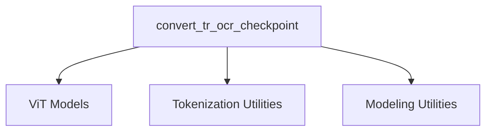

# Module: `trocr_models`

## Introduction
The `trocr_models` module is responsible for providing functionalities related to the TrOCR (Transformer-based Optical Character Recognition) model. Its primary purpose is to facilitate the conversion of pre-trained TrOCR checkpoints from external sources (like UniLM) into a format compatible with the Hugging Face `VisionEncoderDecoderModel` architecture. This module ensures seamless integration and usability of TrOCR models within the Hugging Face ecosystem.

## Architecture and Component Relationships

The `trocr_models` module, at its core, revolves around the conversion utility that adapts external TrOCR checkpoints. It relies on several external modules for its encoder and decoder components, as well as for image processing and tokenization.

<!-- DIAGRAM_JSON
{
    "direction": "TD",
    "nodes": [
        {"id": "convert_tr_ocr_checkpoint", "label": "convert_tr_ocr_checkpoint", "type": "component", "link": null},
        {"id": "vit_models", "label": "ViT Models", "type": "external", "link": "vit_models.md"},
        {"id": "tokenization_utilities", "label": "Tokenization Utilities", "type": "external", "link": "tokenization_utilities.md"},
        {"id": "modeling_utilities", "label": "Modeling Utilities", "type": "external", "link": "modeling_utilities.md"}
    ],
    "edges": [
        {"source": "convert_tr_ocr_checkpoint", "target": "vit_models"},
        {"source": "convert_tr_ocr_checkpoint", "target": "tokenization_utilities"},
        {"source": "convert_tr_ocr_checkpoint", "target": "modeling_utilities"}
    ],
    "groups": []
}
-->

### Core Components

#### `convert_tr_ocr_checkpoint`

This function is the central piece of the `trocr_models` module. It handles the entire process of taking an external TrOCR checkpoint URL and transforming its weights to fit the Hugging Face `VisionEncoderDecoderModel` structure.

**Key responsibilities**:
-   **Configuration Adaptation**: Dynamically sets up `ViTConfig` (for the encoder) and `TrOCRConfig` (for the decoder) based on the input `checkpoint_url`, distinguishing between 'base'/'large' and 'printed'/'handwritten' model variants.
-   **Model Instantiation**: Initializes the `ViTModel` as the encoder and `TrOCRForCausalLM` as the decoder, then combines them into a `VisionEncoderDecoderModel`.
-   **State Dictionary Manipulation**: Loads the original model's state dictionary, renames keys to align with Hugging Face's naming conventions, removes irrelevant parameters, and prefixes decoder keys correctly.
-   **Weight Loading**: Loads the meticulously prepared state dictionary into the instantiated Hugging Face `VisionEncoderDecoderModel`.
-   **Verification**: Performs an integrity check by processing a sample image and asserting that the output logits match expected values for various TrOCR model types.
-   **Saving**: Saves the converted model and a `TrOCRProcessor` (which encapsulates `ViTImageProcessor` and `RobertaTokenizer`) to the specified output path, making them ready for immediate use within the Hugging Face ecosystem.

**Dependencies**:
-   **[ViT Models](vit_models.md)**: Utilized for the visual encoder (`ViTConfig`, `ViTModel`, `ViTImageProcessor`).
-   **[Tokenization Utilities](tokenization_utilities.md)**: Leveraged for text tokenization (`RobertaTokenizer`).
-   **[Modeling Utilities](modeling_utilities.md)**: Provides the overarching `VisionEncoderDecoderModel` structure that combines the visual encoder and text decoder.

## How `trocr_models` Fits into the Overall System

The `trocr_models` module plays a crucial role in expanding the range of readily available OCR models within the larger system. By providing a robust conversion mechanism, it allows developers to integrate TrOCR checkpoints directly, ensuring that state-of-the-art OCR capabilities are accessible without requiring manual weight porting. It acts as a bridge, transforming models from external formats into the standardized Hugging Face `VisionEncoderDecoderModel` format, which can then be used with common pipelines for inference, fine-tuning, and other tasks. Its integration enables other modules that require text recognition from images to seamlessly utilize TrOCR models.