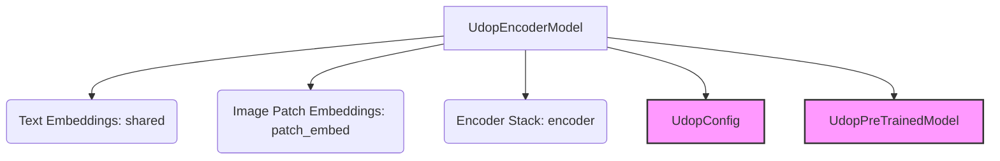

# UDOP Encoder Only Module Documentation

## Introduction
The `udop_encoder_only` module provides the encoder-only architecture for the UDOP model, designed for multimodal tasks involving both text and images. Its primary component, `UdopEncoderModel`, integrates text and image embeddings to produce a unified representation.

## Core Functionality
The `UdopEncoderModel` is a multimodal encoder that processes both textual `input_ids` and visual `pixel_values`, along with their corresponding bounding box information (`bbox` and `visual_bbox`). It combines text and image features into a single sequence representation through its `shared` text embedding layer and `patch_embed` image embedding layer, which are then processed by a `UdopStack` encoder. This architecture is suitable for tasks where a rich, multimodal understanding of the input is required, such as document understanding or visual question answering.

## Architecture and Component Relationships

<!-- DIAGRAM_JSON
{
    "direction": "TD",
    "nodes": [
        {"id": "udop_encoder_model", "label": "UdopEncoderModel", "type": "component", "link": null},
        {"id": "text_embeddings", "label": "Text Embeddings (shared)", "type": "component", "link": null},
        {"id": "patch_embeddings", "label": "Image Patch Embeddings (patch_embed)", "type": "component", "link": null},
        {"id": "encoder_stack", "label": "Encoder Stack (encoder)", "type": "component", "link": null},
        {"id": "udop_config", "label": "UdopConfig", "type": "external", "link": "udop_models.md"},
        {"id": "udop_pretrained_model", "label": "UdopPreTrainedModel", "type": "external", "link": "udop_models.md"}
    ],
    "edges": [
        {"source": "udop_encoder_model", "target": "text_embeddings"},
        {"source": "udop_encoder_model", "target": "patch_embeddings"},
        {"source": "udop_encoder_model", "target": "encoder_stack"},
        {"source": "udop_encoder_model", "target": "udop_config"},
        {"source": "udop_encoder_model", "target": "udop_pretrained_model"}
    ],
    "groups": []
}
-->

The `UdopEncoderModel` is the central component. It initializes with a [UdopConfig](udop_models.md) object, defining its architecture. It inherits from [UdopPreTrainedModel](udop_models.md), providing common functionalities.

The model's input processing involves:
- **`shared`**: An `nn.Embedding` layer responsible for embedding textual `input_ids`.
- **`patch_embed`**: An instance of `UdopPatchEmbeddings` which processes `pixel_values` (images) and generates patch embeddings, optionally using `visual_bbox` for spatial information. This component is part of the broader UDOP modeling utilities.
- **`encoder`**: An instance of `UdopStack`, which is the core transformer encoder. It takes the combined text and image embeddings and processes them through multiple layers. This component is also part of the broader UDOP modeling utilities.

During the `forward` pass, `UdopEncoderModel` orchestrates the embedding of both text and image inputs and then feeds them into the `encoder` to produce the final hidden states.

## How the module fits into the overall system
The `udop_encoder_only` module, specifically the `UdopEncoderModel`, serves as a fundamental building block within the larger UDOP framework. It provides the capability to generate rich, context-aware multimodal representations from both text and image inputs. This encoder's output, `last_hidden_state`, can then be utilized by various downstream tasks and different heads for specific applications (e.g., classification, question answering, or feeding into a decoder for generation tasks in a full encoder-decoder UDOP model, as seen in the sibling [udop_full_model](udop_full_model.md) module). It is designed to be highly configurable via `UdopConfig`, allowing for adaptation to different multimodal understanding scenarios.