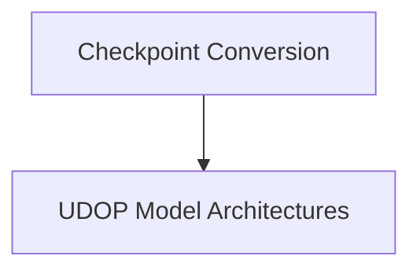

# UDOP Models Documentation

## Introduction
The `udop_models` module provides the core components for the UDOP (Unified Document Pre-training) model, a multi-modal architecture designed for document understanding tasks. This module includes functionalities for converting original UDOP checkpoints to the Hugging Face format and defining the model's encoder-decoder and encoder-only architectures.

## Architecture Overview
The UDOP module is structured into two main logical sub-modules: `conversion_utilities` and `modeling`. The `modeling` sub-module defines the fundamental building blocks and full model architectures, while `conversion_utilities` focuses on enabling the use of pre-trained models by converting their weights.

<!-- DIAGRAM_JSON
{
    "direction": "TD",
    "nodes": [
        {"id": "modeling", "label": "UDOP Model Architectures", "type": "module", "link": "modeling.md"},
        {"id": "conversion_utilities", "label": "Checkpoint Conversion", "type": "module", "link": "conversion_utilities.md"}
    ],
    "edges": [
        {"source": "conversion_utilities", "target": "modeling"}
    ],
    "groups": []
}
-->

### Sub-modules:

*   **[Modeling](modeling.md)**:
    This sub-module encapsulates the core architectural definitions of the UDOP model, including the full encoder-decoder model (`UdopModel`) and the encoder-only variant (`UdopEncoderModel`). It handles the integration of text and image embeddings and defines the forward pass mechanisms for both architectures.

*   **[Conversion Utilities](conversion_utilities.md)**:
    This sub-module is responsible for the practical aspects of integrating pre-trained UDOP models. It provides utilities to convert original UDOP checkpoints into a format compatible with the Hugging Face ecosystem, ensuring proper weight loading, key renaming, and tokenizer configuration.