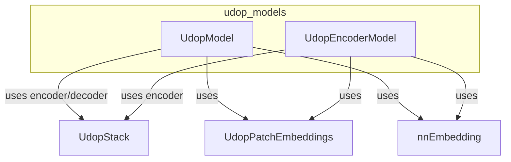

# udop_models
This module provides the core Udop model architecture, including a full encoder-decoder model and an encoder-only variant, both leveraging shared text/image embeddings and a transformer stack.

<!-- DIAGRAM_JSON
{
    "nodes": [
        {
            "id": "UdopModel",
            "label": "UdopModel"
        },
        {
            "id": "UdopEncoderModel",
            "label": "UdopEncoderModel"
        },
        {
            "id": "UdopStack",
            "label": "UdopStack"
        },
        {
            "id": "UdopPatchEmbeddings",
            "label": "UdopPatchEmbeddings"
        },
        {
            "id": "nnEmbedding",
            "label": "nn.Embedding"
        }
    ],
    "edges": [
        {
            "source": "UdopModel",
            "target": "UdopStack",
            "label": "uses encoder/decoder"
        },
        {
            "source": "UdopModel",
            "target": "UdopPatchEmbeddings",
            "label": "uses"
        },
        {
            "source": "UdopModel",
            "target": "nnEmbedding",
            "label": "uses"
        },
        {
            "source": "UdopEncoderModel",
            "target": "UdopStack",
            "label": "uses encoder"
        },
        {
            "source": "UdopEncoderModel",
            "target": "UdopPatchEmbeddings",
            "label": "uses"
        },
        {
            "source": "UdopEncoderModel",
            "target": "nnEmbedding",
            "label": "uses"
        }
    ],
    "groups": [
        {
            "id": "udop_models",
            "label": "udop_models",
            "nodes": [
                "UdopModel",
                "UdopEncoderModel"
            ]
        }
    ]
}
-->
