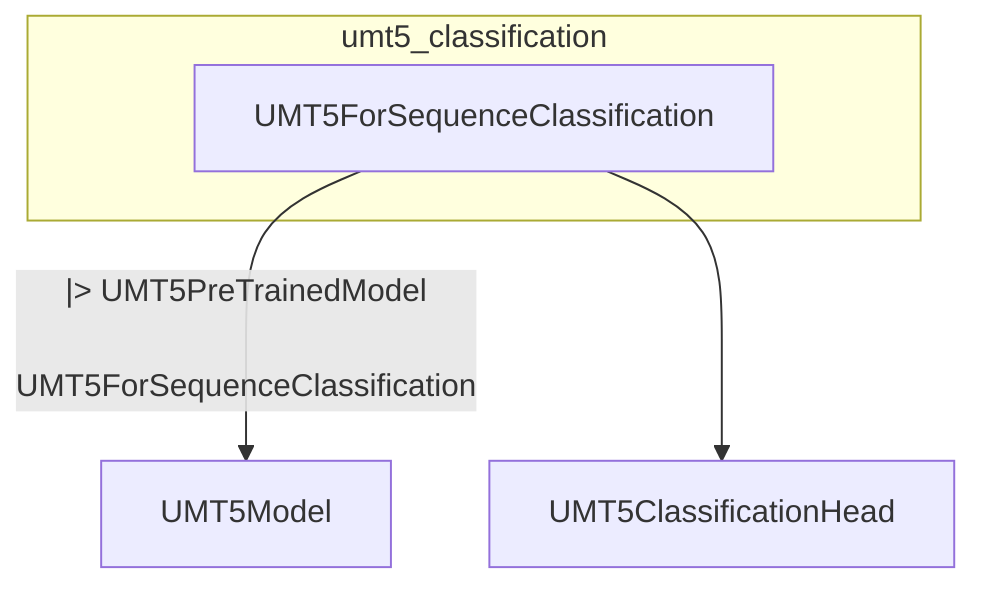

# umt5_classification
This module provides the `UMT5ForSequenceClassification` class, designed for sequence classification tasks using the UMT5 model architecture.

<!-- DIAGRAM_JSON
{
  "nodes": [
    {"id": "UMT5ForSequenceClassification", "label": "UMT5ForSequenceClassification", "type": "class"},
    {"id": "UMT5PreTrainedModel", "label": "UMT5PreTrainedModel", "type": "class"},
    {"id": "UMT5Model", "label": "UMT5Model", "type": "class"},
    {"id": "UMT5ClassificationHead", "label": "UMT5ClassificationHead", "type": "class"}
  ],
  "edges": [
    {"source": "UMT5ForSequenceClassification", "target": "UMT5PreTrainedModel", "label": "inherits"},
    {"source": "UMT5ForSequenceClassification", "target": "UMT5Model", "label": "uses"},
    {"source": "UMT5ForSequenceClassification", "target": "UMT5ClassificationHead", "label": "uses"}
  ],
  "groups": [
    {"id": "umt5_classification_module", "label": "umt5_classification", "nodes": ["UMT5ForSequenceClassification"]}
  ]
}
-->
