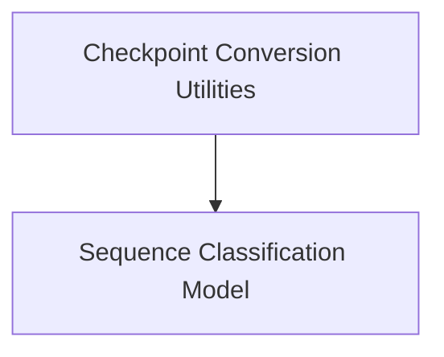

# UMT5 Models Documentation

## Introduction
The `umt5_models` module provides core functionalities for working with UMT5 (Unifying Multi-task T5) models, including utilities for converting checkpoints from T5X to PyTorch and a dedicated model for sequence classification tasks.

## Architecture Overview
This module's architecture is centered around two main functional areas: checkpoint handling and sequence classification. The `checkpoint_conversion` sub-module facilitates the interoperability of UMT5 models between different frameworks, while the `sequence_classification` sub-module provides the necessary model architecture for performing classification tasks.

<!-- DIAGRAM_JSON
{
    "direction": "TD",
    "nodes": [
        {"id": "checkpoint_conversion", "label": "Checkpoint Conversion Utilities", "type": "module", "link": "checkpoint_conversion.md"},
        {"id": "sequence_classification", "label": "Sequence Classification Model", "type": "module", "link": "sequence_classification.md"}
    ],
    "edges": [
        {"source": "checkpoint_conversion", "target": "sequence_classification"}
    ],
    "groups": []
}
-->

## Sub-modules

### [Checkpoint Conversion Utilities](checkpoint_conversion.md)
This sub-module contains utilities for converting UMT5 model checkpoints from the T5X format to PyTorch, ensuring compatibility and ease of use within the PyTorch ecosystem.

### [Sequence Classification Model](sequence_classification.md)
This sub-module provides the `UMT5ForSequenceClassification` model, designed for performing sequence classification tasks using the UMT5 architecture. It includes the model definition and forward pass logic for classification and regression problems.