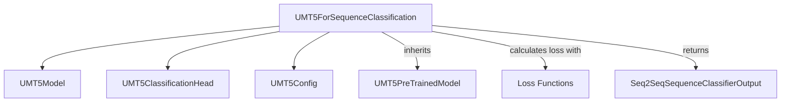

# UMT5 Sequence Classification Module

This module provides the `UMT5ForSequenceClassification` model, an extension of the UMT5 architecture specifically designed for sequence classification and regression tasks. It leverages the powerful UMT5 encoder-decoder transformer for feature extraction and integrates a classification head to predict labels based on the sequence representation.

## Architecture and Component Relationships

The `UMT5ForSequenceClassification` model builds upon the core UMT5 model by adding a classification layer on top of its encoder outputs. It processes input sequences, extracts meaningful representations, and then applies a feed-forward network to produce logits for classification or regression.

<!-- DIAGRAM_JSON
{
    "direction": "TD",
    "nodes": [
        {"id": "UMT5ForSequenceClassification", "label": "UMT5ForSequenceClassification", "type": "component", "link": null},
        {"id": "UMT5Model", "label": "UMT5Model", "type": "external", "link": "umt5_models.md"},
        {"id": "UMT5ClassificationHead", "label": "UMT5ClassificationHead", "type": "component", "link": null},
        {"id": "UMT5PreTrainedModel", "label": "UMT5PreTrainedModel", "type": "external", "link": "umt5_models.md"},
        {"id": "UMT5Config", "label": "UMT5Config", "type": "external", "link": "umt5_models.md"},
        {"id": "Loss_Functions", "label": "Loss Functions", "type": "component", "link": null},
        {"id": "Seq2SeqSequenceClassifierOutput", "label": "Seq2SeqSequenceClassifierOutput", "type": "external", "link": null}
    ],
    "edges": [
        {"source": "UMT5ForSequenceClassification", "target": "UMT5Model"},
        {"source": "UMT5ForSequenceClassification", "target": "UMT5ClassificationHead"},
        {"source": "UMT5ForSequenceClassification", "target": "UMT5Config"},
        {"source": "UMT5ForSequenceClassification", "target": "UMT5PreTrainedModel", "label": "inherits"},
        {"source": "UMT5ForSequenceClassification", "target": "Loss_Functions", "label": "calculates loss with"},
        {"source": "UMT5ForSequenceClassification", "target": "Seq2SeqSequenceClassifierOutput", "label": "returns"}
    ],
    "groups": []
}
-->

### UMT5ForSequenceClassification

`UMT5ForSequenceClassification` is the primary class in this module. It is a UMT5 model with a sequence classification/regression head on top (e.g., for GLUE tasks).

**Core Functionality:**

-   **Initialization:** The model is initialized with a `UMT5Config` object, which defines the model's architecture and hyper-parameters. It instantiates an `UMT5Model` for the base transformer and an `UMT5ClassificationHead` for the task-specific output.
-   **Forward Pass:**
    -   Takes `input_ids`, `attention_mask`, `decoder_input_ids`, `labels`, and other optional arguments.
    -   If `decoder_input_ids` are not provided, they are automatically generated by shifting the `input_ids` to the right. This behavior is similar to other encoder-decoder models like BART.
    -   The inputs are passed through the `UMT5Model` to obtain the sequence output.
    -   A sentence representation is extracted from the `sequence_output` by masking out tokens up to the `eos_token_id`.
    -   This sentence representation is then fed into the `UMT5ClassificationHead` to produce raw `logits`.
    -   If `labels` are provided, a loss function (`MSELoss` for regression, `CrossEntropyLoss` for single-label classification, `BCEWithLogitsLoss` for multi-label classification) is applied to compute the loss.
    -   The method returns a `Seq2SeqSequenceClassifierOutput` object, containing the loss, logits, and other hidden states/attentions from the transformer.

**Parameters:**

-   `input_ids`: Indices of input sequence tokens.
-   `attention_mask`: Mask to avoid performing attention on padding token indices.
-   `decoder_input_ids`: Indices of decoder input sequence tokens.
-   `labels`: Labels for computing the sequence classification/regression loss.

**Return Type:**

-   `Seq2SeqSequenceClassifierOutput`: A dataclass containing `loss`, `logits`, `past_key_values`, `decoder_hidden_states`, `decoder_attentions`, `cross_attentions`, `encoder_last_hidden_state`, `encoder_hidden_states`, and `encoder_attentions`.

## Module Dependencies

This module primarily depends on the core components of the [umt5_models](umt5_models.md) for its base transformer functionality and configuration.

-   **[UMT5Model](umt5_models.md)**: Provides the core encoder-decoder transformer architecture. `UMT5ForSequenceClassification` uses this as its backbone for generating contextualized embeddings.
-   **[UMT5PreTrainedModel](umt5_models.md)**: The base class from which `UMT5ForSequenceClassification` inherits, providing shared functionalities like weight initialization and model loading.
-   **[UMT5Config](umt5_models.md)**: The configuration class used to instantiate and define the architecture of the UMT5 model.
-   **UMT5ClassificationHead**: An internal classification head used to transform the UMT5 model's output into task-specific logits.
-   **Torch Loss Functions**: Utilizes `torch.nn.MSELoss`, `torch.nn.CrossEntropyLoss`, and `torch.nn.BCEWithLogitsLoss` for computing the loss based on the problem type.
-   **Seq2SeqSequenceClassifierOutput**: A standard output dataclass provided by the Hugging Face `transformers` library for sequence-to-sequence classification tasks.
