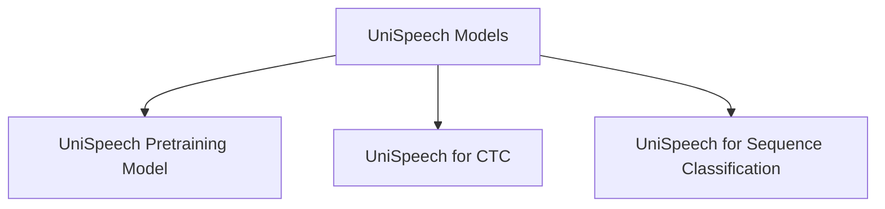

# UniSpeech Models Documentation

## Introduction

The `unispeech_models` module provides various implementations of the UniSpeech architecture tailored for specific machine learning tasks. These models leverage the core UniSpeech capabilities to address diverse applications such as self-supervised pre-training, Connectionist Temporal Classification (CTC) for speech-to-text, and sequence classification for tasks like sentiment analysis or intent recognition.

## Architecture Overview

The UniSpeech models within this module are built upon a shared UniSpeech base, extending it with task-specific heads and functionalities. The diagram below illustrates the high-level architecture and the relationship between the main `unispeech_models` module and its specialized sub-modules.

<!-- DIAGRAM_JSON
{
    "direction": "TD",
    "nodes": [
        {"id": "unispeech_models", "label": "UniSpeech Models", "type": "module"},
        {"id": "unispeech_pretraining", "label": "UniSpeech Pretraining Model", "type": "module", "link": "unispeech_pretraining.md"},
        {"id": "unispeech_ctc", "label": "UniSpeech for CTC", "type": "module", "link": "unispeech_ctc.md"},
        {"id": "unispeech_sequence_classification", "label": "UniSpeech for Sequence Classification", "type": "module", "link": "unispeech_sequence_classification.md"}
    ],
    "edges": [
        {"source": "unispeech_models", "target": "unispeech_pretraining"},
        {"source": "unispeech_models", "target": "unispeech_ctc"},
        {"source": "unispeech_models", "target": "unispeech_sequence_classification"}
    ],
    "groups": []
}
-->

## Sub-modules

This module is composed of the following key sub-modules, each designed for a specific task:

*   ### [UniSpeech Pretraining Model](unispeech_pretraining.md)
    Handles the self-supervised pretraining task for UniSpeech models, including contrastive loss computation and feature quantization.

*   ### [UniSpeech for CTC](unispeech_ctc.md)
    Implements the UniSpeech model adapted for Connectionist Temporal Classification (CTC) tasks, primarily for speech-to-text applications.

*   ### [UniSpeech for Sequence Classification](unispeech_sequence_classification.md)
    Provides the UniSpeech model configured for sequence classification tasks, often used in speech intent recognition or sentiment analysis.
