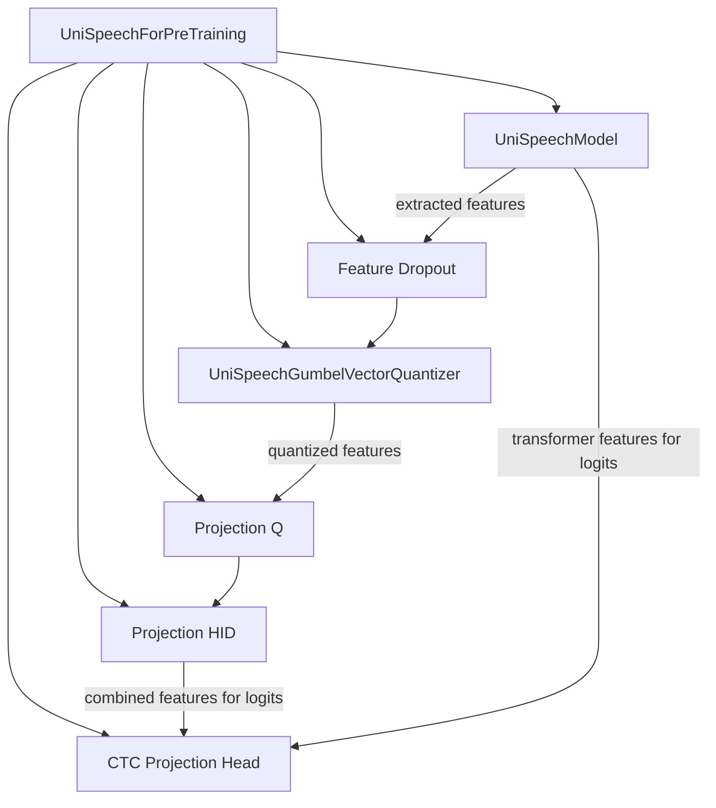

# UniSpeech Pretraining Module

## Introduction

The `unispeech_pretraining` module is a crucial component within the UniSpeech framework, specifically designed for the self-supervised pre-training of the UniSpeech model. It enables the model to learn rich, context-aware representations from raw audio data without requiring labeled transcriptions, preparing it for various downstream speech processing tasks.

## Core Functionality

The primary functionality of this module is encapsulated within the `UniSpeechForPreTraining` class, which extends `UniSpeechPreTrainedModel`. This class orchestrates the pre-training process by integrating a base UniSpeech model with Gumbel vector quantization and a CTC projection head.

### UniSpeechForPreTraining

- **Purpose**: Facilitates the pre-training of UniSpeech models using techniques like Gumbel vector quantization and contrastive learning (with a placeholder for loss computation).
- **Feature Extraction**: Utilizes an internal [UniSpeechModel](unispeech_models.md) instance to extract features from input audio.
- **Gumbel Vector Quantization**: Employs a [UniSpeechGumbelVectorQuantizer](quantizers.md) to discretize the continuous speech representations, which is vital for self-supervised learning approaches that rely on target prediction.
- **Feature Projection**: Projects the quantized features through several linear layers (`project_q`, `project_hid`) to match the hidden size of the transformer.
- **CTC Projection Head**: Includes a `ctc_proj` layer to project the final hidden states to CTC units, enabling the model to be fine-tuned for Automatic Speech Recognition (ASR) tasks.
- **Gumbel Temperature Control**: Provides `set_gumbel_temperature` to adjust the Gumbel softmax temperature during training.
- **Feature Encoder Freezing**: Offers `freeze_feature_encoder` to disable gradient computation for the feature encoder, a common practice during fine-tuning phases or when focusing on other parts of the model.
- **Contrastive Logits Computation**: Contains a static method `compute_contrastive_logits` for calculating contrastive loss logits based on cosine similarity.

## Architecture and Component Relationships

The `unispeech_pretraining` module's core component, `UniSpeechForPreTraining`, builds upon the base [UniSpeechModel](unispeech_models.md) for feature extraction and leverages the [UniSpeechGumbelVectorQuantizer](quantizers.md) for speech unit learning. The interaction between these components defines the pre-training pipeline.

<!-- DIAGRAM_JSON
{
    "direction": "TD",
    "nodes": [
        {"id": "unispeech_for_pretraining_component", "label": "UniSpeechForPreTraining", "type": "component", "link": null},
        {"id": "unispeech_model", "label": "UniSpeechModel", "type": "external", "link": "unispeech_models.md"},
        {"id": "gumbel_vector_quantizer", "label": "UniSpeechGumbelVectorQuantizer", "type": "external", "link": "quantizers.md"},
        {"id": "feature_dropout_layer", "label": "Feature Dropout", "type": "component", "link": null},
        {"id": "quantization_projection_q", "label": "Projection Q", "type": "component", "link": null},
        {"id": "quantization_projection_hid", "label": "Projection HID", "type": "component", "link": null},
        {"id": "ctc_projection_head", "label": "CTC Projection Head", "type": "component", "link": null}
    ],
    "edges": [
        {"source": "unispeech_for_pretraining_component", "target": "unispeech_model"},
        {"source": "unispeech_for_pretraining_component", "target": "gumbel_vector_quantizer"},
        {"source": "unispeech_for_pretraining_component", "target": "feature_dropout_layer"},
        {"source": "unispeech_for_pretraining_component", "target": "quantization_projection_q"},
        {"source": "unispeech_for_pretraining_component", "target": "quantization_projection_hid"},
        {"source": "unispeech_for_pretraining_component", "target": "ctc_projection_head"},

        {"source": "unispeech_model", "target": "feature_dropout_layer", "label": "extracted features"},
        {"source": "feature_dropout_layer", "target": "gumbel_vector_quantizer"},
        {"source": "gumbel_vector_quantizer", "target": "quantization_projection_q", "label": "quantized features"},
        {"source": "quantization_projection_q", "target": "quantization_projection_hid"},
        {"source": "quantization_projection_hid", "target": "ctc_projection_head", "label": "combined features for logits"},
        {"source": "unispeech_model", "target": "ctc_projection_head", "label": "transformer features for logits"}
    ],
    "groups": []
}
-->

## How the module fits into the overall system

The `unispeech_pretraining` module serves as the foundational stage for developing UniSpeech-based models. By pre-training on large amounts of unlabeled audio, it learns general-purpose speech representations that can then be efficiently transferred to various downstream tasks with minimal labeled data. This approach significantly reduces the data requirements for tasks such as ASR, speech translation, and speaker recognition.

It is part of the larger [unispeech_models](unispeech_models.md) ecosystem, providing the pre-training capabilities that are essential for the overall UniSpeech architecture. Once pre-trained, the model can be fine-tuned using specific task heads, such as those found in the [unispeech_sequence_classification](unispeech_sequence_classification.md) or [unispeech_ctc](unispeech_ctc.md) modules, to achieve state-of-the-art performance in specialized speech applications.