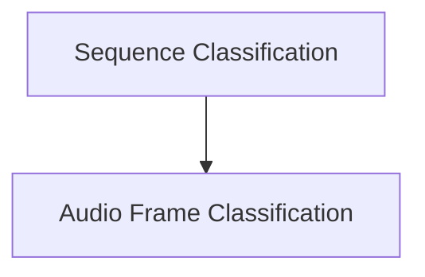

# UniSpeechSat Classification Models

The `unispeech_sat_classification_models` module provides implementations for various classification tasks using the UniSpeechSat model architecture. It offers specialized models for both sequence-level and audio frame-level classification, building upon the foundational UniSpeechSat model.

## Architecture Overview

This module is structured into two main sub-modules, each focusing on a specific classification task. Both sub-modules leverage the core `UniSpeechSatModel` for feature extraction and then apply dedicated classification heads.

<!-- DIAGRAM_JSON
{
    "direction": "TD",
    "nodes": [
        {"id": "sequence_classification", "label": "Sequence Classification", "type": "module", "link": "sequence_classification.md"},
        {"id": "audio_frame_classification", "label": "Audio Frame Classification", "type": "module", "link": "audio_frame_classification.md"}
    ],
    "edges": [
        {"source": "sequence_classification", "target": "audio_frame_classification"}
    ],
    "groups": []
}
-->

## Sub-modules

### [Sequence Classification](sequence_classification.md)
This sub-module contains the `UniSpeechSatForSequenceClassification` component, designed for tasks where the entire audio sequence is classified into one of several categories. It extends the base UniSpeechSat model with a linear projection and a classification head.

### [Audio Frame Classification](audio_frame_classification.md)
This sub-module provides the `UniSpeechSatForAudioFrameClassification` component, which is used for classifying individual audio frames within a sequence. This is particularly useful for tasks like phoneme classification or speaker diarization, where a label is assigned to each frame of the audio input.