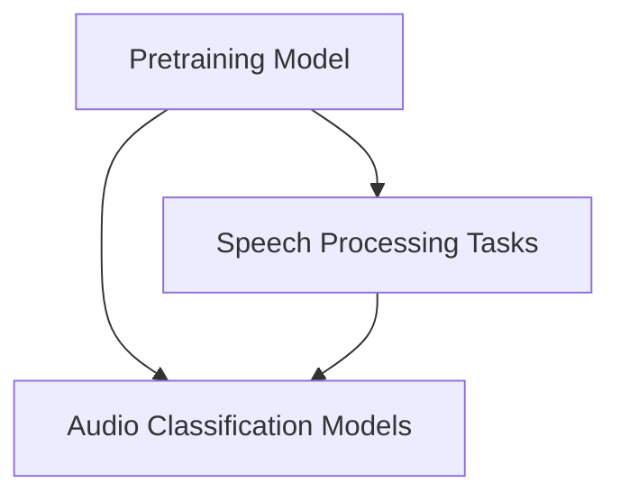

# UniSpeech-SAT Models Documentation

## Introduction and Purpose

The `unispeech_sat_models` module provides various specialized models built upon the UniSpeech-SAT architecture. These models extend the core UniSpeech-SAT capabilities to address a range of audio processing and speech-related tasks, including pretraining, speaker verification (X-vector), automatic speech recognition (CTC), and audio classification. This module aims to offer a flexible and extensible framework for leveraging UniSpeech-SAT in diverse applications.

## Architecture Overview

The `unispeech_sat_models` module is structured around several sub-modules, each focusing on a specific set of tasks or functionalities. All models within this module are built on top of the base `UniSpeechSatModel`, integrating its powerful feature extraction and transformer layers with task-specific heads.

<!-- DIAGRAM_JSON
{
    "direction": "TD",
    "nodes": [
        {"id": "pretraining", "label": "Pretraining Model", "type": "module", "link": "pretraining.md"},
        {"id": "speech_tasks", "label": "Speech Processing Tasks", "type": "module", "link": "speech_tasks.md"},
        {"id": "classification_tasks", "label": "Audio Classification Models", "type": "module", "link": "classification_tasks.md"}
    ],
    "edges": [
        {"source": "pretraining", "target": "speech_tasks"},
        {"source": "pretraining", "target": "classification_tasks"},
        {"source": "speech_tasks", "target": "classification_tasks"}
    ],
    "groups": []
}
-->

## High-Level Functionality of Each Sub-module

### [Pretraining Model](pretraining.md)
This sub-module focuses on the self-supervised pretraining of the UniSpeech-SAT model. It includes components like `UniSpeechSatForPreTraining` which is designed to learn robust audio representations using a contrastive loss mechanism.

### [Speech Processing Tasks](speech_tasks.md)
This sub-module encompasses models tailored for specific speech processing tasks. It includes:
- `UniSpeechSatForXVector`: For extracting X-vectors, primarily used in speaker verification and identification.
- `UniSpeechSatForCTC`: Implements the Connectionist Temporal Classification (CTC) loss for end-to-end automatic speech recognition.

### [Audio Classification Models](classification_tasks.md)
This sub-module provides models for various audio classification scenarios, including:
- `UniSpeechSatForSequenceClassification`: For classifying entire audio sequences.
- `UniSpeechSatForAudioFrameClassification`: For classifying individual audio frames.
